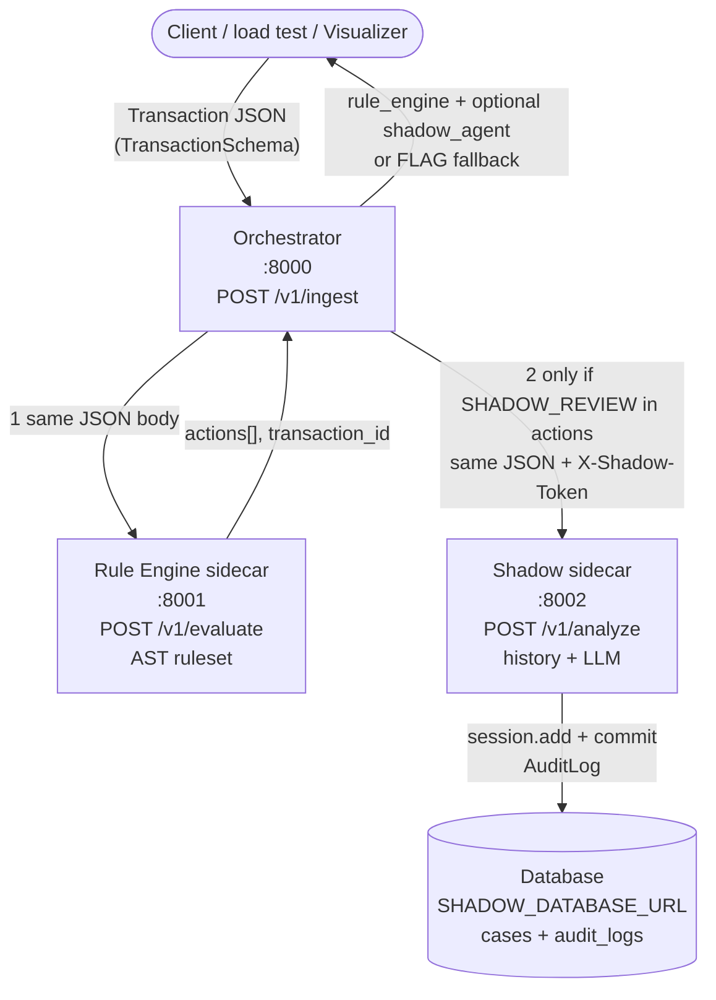
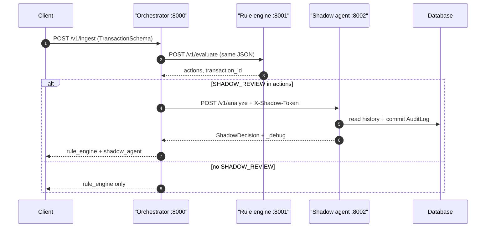

# Tarka V2 — Ingestion sidecar architecture (audit-first)

This document describes the **decoupled sidecar pipeline** under `tarka_v2_core/services/`: **Orchestrator** (ingestion gateway), **Rule Engine** (deterministic AST evaluation), and **Shadow Agent** (optional LLM analyze + persistence). It is distinct from the macroservice **Core API :8000** / **Graph :8001** / **Case :8002** layout in `deploy/docker-compose.lite.yml`.

## Host port convention (V2 local stack)

| Port | Service | HTTP entrypoints | Notes |
|------|---------|------------------|-------|
| **8000** | **Orchestrator** | `POST /v1/ingest` | Single public ingest hop; fans out over HTTP to sidecars. |
| **8001** | **Rule Engine** | `POST /v1/evaluate` | In-process AST ruleset; no LLM. |
| **8002** | **Shadow Agent** | `POST /v1/analyze`, `GET /health`, `GET /health/db` | Optional path; persists `AuditLog` rows. |

**Environment wiring (orchestrator process):**

| Variable | Role |
|----------|------|
| `RULE_ENGINE_URL` | Base URL for rule engine (default in code: `http://127.0.0.1:8778` — override to `http://127.0.0.1:8001` when using the table above). |
| `SHADOW_AGENT_URL` | Base URL for Shadow; empty disables Shadow hop (unless rules never emit `SHADOW_REVIEW`). |
| `SHADOW_API_KEY` | If set, orchestrator sends `X-Shadow-Token` on `POST /v1/analyze`. |
| `ORCHESTRATOR_SHADOW_ANALYZE_TIMEOUT_SECONDS` | Read deadline for Shadow HTTP call (default **3s**); on timeout, ingest still returns **200** with `orchestrator_fallback_decision` / `FLAG` and **no** `shadow_agent` body. |
| `SHADOW_DATABASE_URL` | Async SQLAlchemy URL for Shadow’s DB (audit + case bootstrap). |

Sources: `tarka_v2_core/services/orchestrator/src/orchestrator/main.py`, `rule_engine/main.py`, `shadow_agent/main.py`.

---

## Request / response flow (Mermaid)

### Component flow

**Branching rules (implemented):**

1. Orchestrator **always** calls rule engine `POST /v1/evaluate` first with the transaction JSON.
2. If `SHADOW_REVIEW` **∈** `actions` **and** `SHADOW_AGENT_URL` is set, orchestrator calls Shadow `POST /v1/analyze` with the **same** JSON and optional `X-Shadow-Token`.
3. If `SHADOW_REVIEW` **∉** `actions` (e.g. `BLOCK` only), Shadow is **skipped** — no LLM, no audit row from this hop.
4. If Shadow is required but the HTTP call **times out**, orchestrator returns **200** with `orchestrator_fallback_decision: "FLAG"` (no `shadow_agent` key).

### Sequence (happy path + skip path)

---

## Data schema definitions

### 1. Ingest envelope — `TransactionSchema`

Shared Pydantic model (`tarka_v2_core/services/ingestor/src/ingestor/manifest_schema.py`). **Extra fields forbidden.** Used as the **JSON body** for orchestrator `POST /v1/ingest` and forwarded verbatim to rule engine / Shadow.

| Field | Type | Constraints |
|-------|------|-------------|
| `entity_id` | UUID | Primary correlation id; maps to `audit_logs.case_id` after Shadow persists. |
| `amount` | float | `> 0`, finite. |
| `timestamp` | datetime | ISO-8601 on the wire. |
| `metadata` | object | Default `{}`; rule conditions may inspect (e.g. substring `CONTAINS` on serialized metadata in demo rules). |

### 2. Rule engine — `POST /v1/evaluate` response

Produced by `rule_engine/main.py` after `evaluate_ruleset(...)`:

| Field | Type | Description |
|-------|------|-------------|
| `actions` | `string[]` | Wire values from `Action` enum, e.g. `BLOCK`, `SHADOW_REVIEW`, `FLAG`, … |
| `transaction_id` | string | `str(entity_id)` for correlation. |

AST types (`ConditionNode`, `FieldRef`, `Operator`, `Rule`, …) live in `rule_engine/ast_schemas.py`; the demo ruleset is in-memory in `rule_engine/main.py`.

### 3. Shadow — `POST /v1/analyze` response

Validated `ShadowDecision` plus orchestration-only `_debug` (`shadow_agent/main.py`):

**`ShadowDecision`** (`shadow_agent/schemas.py`):

| Field | Type | Constraints |
|-------|------|-------------|
| `transaction_id` | UUID | |
| `risk_score` | float | 0..100 |
| `is_fraud` | bool | |
| `reasoning` | string[] | |
| `confidence_metrics` | object | |

**`_debug`** (response-only, not part of LLM schema):

| Field | Description |
|-------|-------------|
| `audit_log_id` | Surrogate key after commit (or `null` on integrity edge cases). |
| `audit_log_snapshot` | Correlation + capped prompt/response excerpts for operators. |

### 4. Audit trail — SQLAlchemy ORM

`AuditLog` (`tarka_v2_core/services/shared/tarka_shared/audit_trail.py`), table **`audit_logs`**:

| Column | Type | Description |
|--------|------|-------------|
| `id` | int, PK | Autoincrement. |
| `case_id` | string(36), FK → `cases.id` | Set to transaction / entity id for shadow evaluations; `Case` row is ensured before insert. |
| `action_taken` | text | Persisted decision payload / narrative (JSON text in shadow path). |
| `code_executed` | text, nullable | e.g. prompt material / tool trace. |
| `agent_notes` | text, nullable | e.g. model output excerpt. |
| `timestamp` | timestamptz | Server default `now()`. |

Shadow agent loads prior rows for `entity_id` before LLM inference, then **adds + commits** a new `AuditLog` in the same request path (`shadow_agent/agent.py`).

---

## Related paths in repo

| Path | Purpose |
|------|---------|
| `tarka_v2_core/services/orchestrator/` | Ingest gateway, httpx to rule engine + Shadow. |
| `tarka_v2_core/services/rule_engine/` | AST evaluator sidecar. |
| `tarka_v2_core/services/shadow_agent/` | Analyze + audit persistence + Ollama client. |
| `tarka_v2_core/services/ingestor/` | `TransactionSchema` + manifest types. |
| `tarka_v2_core/services/shared/tarka_shared/` | `AuditLog`, `Case`, DB session helpers. |
| `scripts/stress_test_ingestion.py` | Concurrent ingest + optional `audit_logs` count gate. |

---

## Mermaid rendering in the editor

Open this file in the editor and use **Markdown preview** (e.g. “Open Preview” / built-in preview pane). VS Code–compatible Markdown preview renders fenced `mermaid` blocks.
