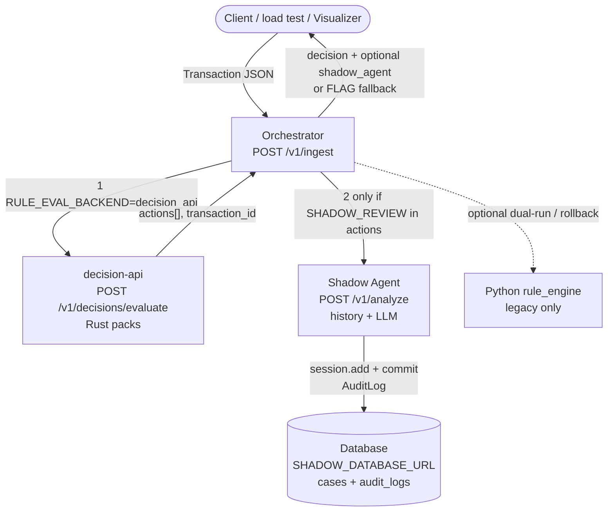
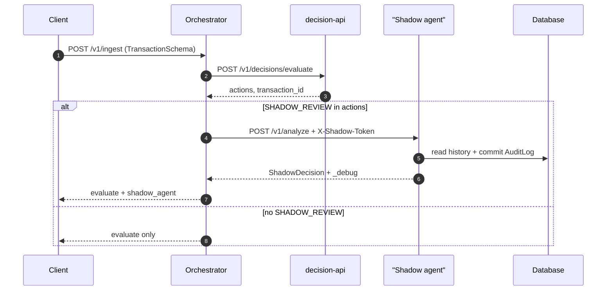

# Tarka — evaluate + ingest architecture (audit-first)

Canonical **deterministic evaluate** is **decision-api** (Rust packs via `tarka-core`), reached as:

- **Macroservice:** `core-api` → `POST /decisions/v1/decisions/evaluate` (default compose: Lite)
- **Ingest rail:** Orchestrator `POST /v1/ingest` with `RULE_EVAL_BACKEND=decision_api` and `DECISION_API_URL` (e.g. `http://core-api:8000/decisions` or `http://decision-api:8000`)

The Python AST sidecar (`services/rule_engine`, historically `:8778` / `:8001`) is **legacy dual-run / rollback only** (`RULE_EVAL_BACKEND=python` or `RULE_EVAL_DUAL_RUN=true`). See `services/rule_engine/DEPRECATED.md` and `infra/deploy/docker-compose.v2-ingest.yml` profile `legacy-python-rules`.

`services/core_v2` is **quarantined** — not on the default stack. Use `docker-compose.streams-ai.yml` only if you still need that Redis-streams speed layer.

---

## Default stacks (pick one)

| Stack | Compose | Evaluate surface |
|-------|---------|------------------|
| **Default / Lite** | `docker-compose.yml` → `infra/deploy/docker-compose.lite.yml` | `core-api` `:8000` `/decisions/.../evaluate` |
| **V2 ingest** | `infra/deploy/docker-compose.v2-ingest.yml` | Orchestrator → decision-api; Shadow on `SHADOW_REVIEW` |
| **Streams AI (legacy)** | `docker-compose.streams-ai.yml` | `core_v2` (deprecated) + ML/copilot sidecars |

---

## Host port convention (V2 ingest rail)

| Port | Service | HTTP entrypoints | Notes |
|------|---------|------------------|-------|
| **8000** | **Orchestrator** *or* **decision-api / core-api** | Ingest *or* evaluate | Do not run two owners of `:8000` in one stack. |
| **8001** | **Rule Engine** (optional) | `POST /v1/evaluate` | Profile `legacy-python-rules` only. |
| **8002** | **Shadow Agent** | `POST /v1/analyze`, `GET /health` | Ingest LLM + audit; see Shadow brand map below. |

**Environment wiring (orchestrator process):**

| Variable | Role |
|----------|------|
| `DECISION_API_URL` | Base URL for decision-api (no trailing slash), e.g. `http://decision-api:8000` or `http://core-api:8000/decisions`. |
| `RULE_EVAL_BACKEND` | Default **`decision_api`**. Falls back to `python` if `DECISION_API_URL` unset. |
| `RULE_EVAL_DUAL_RUN` | When true, call both backends; side effects from decision-api; log `orchestrator_rule_eval_dual_run`. |
| `RULE_ENGINE_URL` | Python sidecar base (default in code: `http://127.0.0.1:8778`). |
| `SHADOW_AGENT_URL` | Shadow HTTP base; empty disables Shadow hop (unless rules never emit `SHADOW_REVIEW`). |
| `SHADOW_API_KEY` | If set, orchestrator sends `X-Shadow-Token` on `POST /v1/analyze`. |
| `ORCHESTRATOR_SHADOW_ANALYZE_TIMEOUT_SECONDS` | Read deadline for Shadow (default **3s**); on timeout, ingest still returns **200** with `orchestrator_fallback_decision` / `FLAG`. |
| `SHADOW_DATABASE_URL` | Async SQLAlchemy URL for Shadow’s DB (audit + case bootstrap). |

Sources: `services/orchestrator/main.py`, `services/orchestrator/decision_evaluate_bridge.py`, `services/shadow_agent/main.py`.

---

## Request / response flow (Mermaid)

### Component flow (canonical)

```mermaid
flowchart TB
  Client(["Client / load test / Visualizer"])
  O["Orchestrator\nPOST /v1/ingest"]
  D["decision-api\nPOST /v1/decisions/evaluate\nRust packs"]
  S["Shadow Agent\nPOST /v1/analyze\nhistory + LLM"]
  DB[("Database\nSHADOW_DATABASE_URL\ncases + audit_logs")]
  Py["Python rule_engine\nlegacy only"]

  Client -->|"Transaction JSON"| O
  O -->|"1 RULE_EVAL_BACKEND=decision_api"| D
  O -.->|"optional dual-run / rollback"| Py
  D -->|"actions[], transaction_id"| O
  O -->|"2 only if SHADOW_REVIEW in actions"| S
  S -->|"session.add + commit\nAuditLog"| DB
  O -->|"decision + optional shadow_agent\nor FLAG fallback"| Client
```

**Branching rules (implemented):**

1. Orchestrator evaluates first via **decision-api** (or Python when backend/`DECISION_API_URL` forces it).
2. If `SHADOW_REVIEW` **∈** `actions` **and** `SHADOW_AGENT_URL` is set, orchestrator calls Shadow `POST /v1/analyze` with the **same** JSON and optional `X-Shadow-Token`.
3. If `SHADOW_REVIEW` **∉** `actions` (e.g. `BLOCK` only), Shadow is **skipped** — no LLM, no audit row from this hop.
4. If Shadow is required but the HTTP call **times out**, orchestrator returns **200** with `orchestrator_fallback_decision: "FLAG"` (no `shadow_agent` key).

### Sequence (happy path + skip path)

```mermaid
sequenceDiagram
  autonumber
  participant C as Client
  participant O as Orchestrator
  participant D as decision-api
  participant S as "Shadow agent"
  participant Db as Database

  C->>O: POST /v1/ingest (TransactionSchema)
  O->>D: POST /v1/decisions/evaluate
  D-->>O: actions, transaction_id

  alt SHADOW_REVIEW in actions
    O->>S: POST /v1/analyze + X-Shadow-Token
    S->>Db: read history + commit AuditLog
    S-->>O: ShadowDecision + _debug
    O-->>C: evaluate + shadow_agent
  else no SHADOW_REVIEW
    O-->>C: evaluate only
  end
```

---

## Shadow brand map (one product, three paths)

| Path | Role | Product surface? |
|------|------|------------------|
| **`services/shadow_agent`** | FastAPI ingest sidecar (`POST /v1/analyze`) | **Yes — production Shadow on the ingest rail** |
| **`services/shadow`** | Python library (`tarka-shadow`: hooks, NATS OSINT helpers) | **No — library only**, imported by orchestrator |
| **`tools/shadow`** | Desktop forensics console (local Ollama / Tauri) | **Analyst workstation only** — not default compose |

Do not add a fourth HTTP “Shadow” service. See `services/SHADOW.md`.

---

## Data schema definitions

### 1. Ingest envelope — `TransactionSchema`

Shared Pydantic model (`services/ingestor/src/ingestor/manifest_schema.py`). **Extra fields forbidden.** Used as the **JSON body** for orchestrator `POST /v1/ingest` and forwarded to evaluate / Shadow.

| Field | Type | Constraints |
|-------|------|-------------|
| `entity_id` | UUID | Primary correlation id; maps to `audit_logs.case_id` after Shadow persists. |
| `amount` | float | `> 0`, finite. |
| `timestamp` | datetime | ISO-8601 on the wire. |
| `metadata` | object | Default `{}`; prefer `tenant_id` (or send `X-Tenant-Id`). Missing tenant → **422** on decision-api path. Default `event_type` = **`payment`**. |

### 2. Evaluate — decision-api response (bridged)

Orchestrator maps decision-api evaluate JSON into ingest `actions[]` via `decision_evaluate_bridge.py` (`action_map_v1`). Wire actions include `BLOCK`, `SHADOW_REVIEW`, `FLAG`, …

Legacy Python `POST /v1/evaluate` still returns `{ actions, transaction_id }` from `rule_engine` when that backend is selected.

### 3. Shadow — `POST /v1/analyze` response

Validated `ShadowDecision` plus orchestration-only `_debug` (`shadow_agent/main.py`):

**`ShadowDecision`** (`shadow_agent/schemas.py`):

| Field | Type | Constraints |
|-------|------|-------------|
| `transaction_id` | UUID | |
| `risk_score` | float | 0..100 |
| `is_fraud` | bool | |
| `reasoning` | string[] | |
| `confidence_metrics` | object | |

**`_debug`** (response-only, not part of LLM schema):

| Field | Description |
|-------|-------------|
| `audit_log_id` | Surrogate key after commit (or `null` on integrity edge cases). |
| `audit_log_snapshot` | Correlation + capped prompt/response excerpts for operators. |

### 4. Audit trail — SQLAlchemy ORM

`AuditLog` (`packages/shared-core/tarka_shared/audit_trail.py`), table **`audit_logs`**:

| Column | Type | Description |
|--------|------|-------------|
| `id` | int, PK | Autoincrement. |
| `case_id` | string(36), FK → `cases.id` | Set to transaction / entity id for shadow evaluations; `Case` row is ensured before insert. |
| `action_taken` | text | Persisted decision payload / narrative (JSON text in shadow path). |
| `code_executed` | text, nullable | e.g. prompt material / tool trace. |
| `agent_notes` | text, nullable | e.g. model output excerpt. |
| `timestamp` | timestamptz | Server default `now()`. |

Shadow agent loads prior rows for `entity_id` before LLM inference, then **adds + commits** a new `AuditLog` in the same request path (`shadow_agent/agent.py`).

---

## Related paths in repo

| Path | Purpose |
|------|---------|
| `services/orchestrator/` | Ingest gateway; decision-api bridge + optional Shadow. |
| `services/decision-api/` | Canonical evaluate (Rust packs). |
| `services/core-api/` | Macroservice mounting `/decisions`. |
| `services/rule_engine/` | Legacy Python AST sidecar (profile only). |
| `services/shadow_agent/` | Analyze + audit persistence + Ollama client. |
| `services/shadow/` | Library hooks used by orchestrator (not an HTTP service). |
| `tools/shadow/` | Desktop forensics console. |
| `services/core_v2/` | Quarantined speed-layer; streams-ai compose only. |
| `services/ingestor/` | `TransactionSchema` + manifest types. |
| `packages/shared-core/tarka_shared/` | `AuditLog`, `Case`, DB session helpers. |
| `docs/superpowers/specs/2026-07-11-one-rust-rule-engine-design.md` | Approach A design. |

---

## Mermaid rendering in the editor

Open this file in the editor and use **Markdown preview** (e.g. “Open Preview” / built-in preview pane). VS Code–compatible Markdown preview renders fenced `mermaid` blocks.
