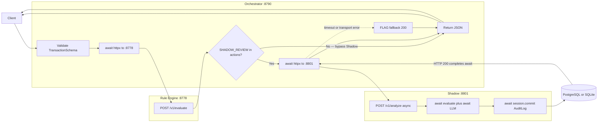
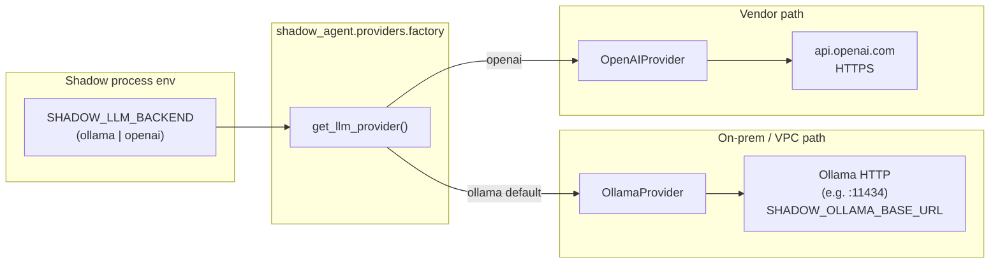

# System design — v2 ingest path (Orchestrator → Rule Engine → Shadow)

This document describes the **TransactionSchema** ingestion flow through the **tarka_v2_core** services that ship today: validation at the API edge, **async HTTP** to the rule engine, an optional **async HTTP** hop to the Shadow sidecar, and—on the Shadow path—a **relational `AuditLog` commit** after the model returns.

**Default dev ports** (all overrideable via env; bind flags are operator-owned):

| Service | Typical URL | Notes |
|--------|----------------|-------|
| **Orchestrator** | `http://127.0.0.1:8790` | `POST /v1/ingest` — load scripts default here. |
| **Rule Engine** | `http://127.0.0.1:8778` | Code default `RULE_ENGINE_URL` in orchestrator. |
| **Shadow sidecar** | `http://127.0.0.1:8801` | `SHADOW_AGENT_URL` in orchestrator; `POST /v1/analyze`. |

Shadow’s LLM backend is selected at runtime by **`SHADOW_LLM_BACKEND`**: `ollama` (on-prem / VPC HTTP to Ollama, commonly `:11434`) vs `openai` (HTTPS to vendor APIs).

---

## End-to-end flow (ports + bypass)

The diagram shows the **cost-saving bypass**: the orchestrator **only** calls Shadow when the rule payload includes **`SHADOW_REVIEW`**. Pure `ALLOW`, `BLOCK`, etc. paths skip the sidecar entirely—no LLM tokens, no Shadow DB work for that hop.



**Trust / data note:** On the **orchestrator-only** branch (no Shadow call), there is **no** Shadow-sidecar `AuditLog` insert for that request in this slice of the stack; the response still carries **`rule_engine`** JSON for caller-side traceability. The **`AuditLog`** row is written when **`ShadowAgent.evaluate`** completes successfully inside the sidecar (`shadow_agent/agent.py`).

---

## Async boundaries (where `await` matters)

```mermaid
sequenceDiagram
  autonumber
  participant C as Client
  participant O as Orchestrator
  participant R as Rule Engine
  participant S as Shadow sidecar
  participant P as LLM provider
  participant DB as AsyncSession DB

  Note over O: Listen :8790 async route
  Note over R: Listen :8778
  Note over S: Listen :8801 async route

  C->>+O: POST /v1/ingest TransactionSchema
  Note over O: Pydantic validation sync boundary
  O->>+R: await httpx POST /v1/evaluate
  R-->>-O: actions list
  alt SHADOW_REVIEW not in actions
    Note over O,R: Bypass Shadow — no sidecar await, no LLM cost
    O-->>-C: 200 rule_engine only
  else SHADOW_REVIEW in actions
    O->>+S: await httpx POST /v1/analyze
    Note over S: FastAPI Depends session + agent
    S->>+P: await completion ollama or openai
    P-->>-S: text to ShadowDecision
    S->>+DB: await session.commit AuditLog
    DB-->>-S: row persisted
    S-->>-O: 200 shadow_agent JSON
    O-->>-C: 200 merged body
  end
```

On Shadow **timeout** or **connection errors**, the orchestrator catches the failed `await` before a body is returned, applies the **FLAG** fallback, and still responds **200** to the client (see `orchestrator/main.py`).

**Orchestrator implementation detail:** One `async with httpx.AsyncClient(...)` holds **sequential** `await` calls: rule engine first, then Shadow only if needed—two **async I/O** boundaries, not a thread pool.

**Shadow implementation detail:** `/v1/analyze` **awaits** `agent.evaluate(tx, session)`, which performs async DB reads/writes and awaits the provider; **`await session.commit()`** runs **before** the HTTP response is returned to the orchestrator.

---

## Cloud / local toggle (Shadow → LLM)



---

## Summary (YC cost angle)

| Path | Shadow called? | LLM invoked? | `AuditLog` commit in sidecar? |
|------|----------------|--------------|--------------------------------|
| Rule output without `SHADOW_REVIEW` | No | No | No |
| `SHADOW_REVIEW` + healthy sidecar | Yes | Yes | Yes (`evaluate` → `commit`) |
| `SHADOW_REVIEW` + timeout / unreachable | No successful analyze | No completion | No (orchestrator returns fallback JSON) |

The **Rule Engine bypass** of Shadow is the default for most demo ruleset outcomes (`ALLOW`, `BLOCK` lane, etc.); **`SHADOW_REVIEW`** is the explicit gate that spends inference budget.
