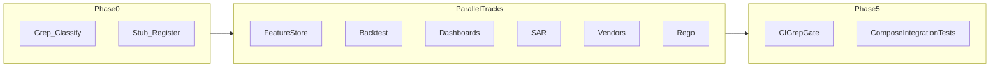

# Tier-1 Honesty Program (repo-wide stub elimination)

**Workstream checklist**

- [ ] Phase 0: Automated inventory (grep/rg) + classify each hit as ship, delete, or gate behind explicit degraded-mode contract
- [ ] Track A: Feature store — Postgres metadata + ClickHouse DDL execution + saga reconciliation (replaces `_STORE`)
- [ ] Track B: Backtest — replace `backtest_run_stub` with read-only ClickHouse queries, bounded memory, real metrics or remove endpoint
- [ ] Track C: Executive KPIs — replace `_stub_kpis` with bounded CH queries + cache; fail closed if CH unavailable
- [ ] Track D: SAR transport — durable filing rows + SFTP client + ACK worker or remove `schedule_ack_poll` until worker exists
- [ ] Track E: Vendors — replace `echo_stub` with real adapter interface + config-driven HTTP + no fake scores in prod
- [ ] Track F: Visual rules — either real Rego/OPA transpilation or stop returning `rego_stub` as if deployable
- [ ] Verification: CI grep gate for forbidden patterns; integration tests against compose Postgres+CH; docs aligned with behavior

**Overview:** Eliminate Potemkin surfaces repo-wide—either ship durable execution against real stores or remove/disable the API until honest. Feature store rewrite is Track A; parallel tracks cover backtest, dashboards, SAR/FinCEN, and vendor registry.

---

# Repo-Wide Stub Elimination (Tier-1 Honesty Program)

**Scope:** This program closes VC-grade gaps **repo-wide**: anything that is a stub, in-memory fake, or happy-path-only surface must become **durable + executed against real infrastructure**, or be **removed / explicitly degraded** with machine-verifiable contracts (no silent `None` KPIs pretending to work).

**Policy (non-negotiable):**

1. **No in-process dicts** for authoritative state (`_STORE`, ad-hoc caches pretending to be DBs).
2. **No `status: stub` JSON** returned as success; if not implemented, return **501** / remove route / feature flag default **off**.
3. **DDL and queries** run against real connections with **timeouts, retries, and idempotency keys**; partial failure states persisted for operators.
4. **Rip-out allowed:** If a subsystem cannot be made honest within the slice, delete the HTTP surface and docs until it can.

---

## Phase 0: Inventory and Classification

- Run a structured search across `services/`, `frontend/`, and `packages/` for `stub`, `_stub`, `placeholder`, `TODO:`, `FIXME`, `mock` (context-filtered), `pass` in route handlers, and in-memory singleton stores.
- For each hit, assign **Ship** (implement), **Delete** (remove API/UI), or **Degrade** (single documented contract, e.g. `503` with `reason_code`, never fake data).
- Produce a **Stub Register** (markdown table in-repo): file, symbol, user-visible behavior today, target disposition.

---

## Track A: Feature Store (original deep plan)

**Problem:** [`services/decision-api/src/decision_api/feature_store_api.py`](../services/decision-api/src/decision_api/feature_store_api.py) uses `_STORE = {}` and never executes ClickHouse.

**Target:** Durable Postgres metadata + executed ClickHouse DDL + reconciliation.

### A1 — Infrastructure and connections

- Add **`asyncpg`** (Postgres) and a supported async ClickHouse client (**`clickhouse-connect`** with async API or **`asynch`**) to decision-api dependencies.
- **`lifespan`** on the FastAPI app: create pools/clients, health-check both on startup (fail fast in strict mode, or log + disable feature store only—pick one policy and document it).

### A2 — Postgres schema

- Table `feature_definitions` (tenant, name, version, definition JSON, fingerprint, `ddl_status`, `clickhouse_error`, timestamps). Alembic migration alongside existing decision-api migrations.

### A3 — ClickHouse execution engine

- Sanitize identifiers (`name`, `group_by`, `source_table`, aggregation whitelist).
- Execute `CREATE MATERIALIZED VIEW` (or `CREATE VIEW` + separate MV if safer) with **statement timeout** and **ON CLUSTER** only if cluster topology is config-driven.
- **Saga:** insert `pending` → execute CH → update `applied` / `failed` with last error; background reconciler optional for stuck `pending`.

### A4 — API refactor

- `POST /definitions` returns persisted row + execution outcome; `GET` lists from Postgres only.

---

## Track B: Distributed Backtesting

**Problem:** [`services/decision-api/src/decision_api/backtest_api.py`](../services/decision-api/src/decision_api/backtest_api.py) — `backtest_run_stub` returns `"status": "stub"` and null metrics.

**Options (choose one per product decision—default: Ship):**

- **Ship:** Dedicated read-only ClickHouse role; run server-side aggregation with **max_execution_time**, **result limits**, and **async job** pattern (`202` + `job_id` + poll) for large windows—never hold unbounded memory in API process.
- **Delete:** Remove `POST /run` until engine exists; keep `preview-sql` only if it remains honest (static SQL template is OK if labeled as operator-run only).

---

## Track C: Embedded Executive KPIs

**Problem:** [`services/decision-api/src/decision_api/analytics_dashboards.py`](../services/decision-api/src/decision_api/analytics_dashboards.py) — `_stub_kpis` returns `None` for all metrics.

**Target:**

- Bounded parameterized queries against ClickHouse (or Postgres if lite profile)—**no fabricated numbers**.
- If CH unavailable: **503** with structured error, not cached nulls pretending to be data.

---

## Track D: SAR / FinCEN Transport

**Problem:** [`services/case-api/src/case_api/sar_filing_transport.py`](../services/case-api/src/case_api/sar_filing_transport.py) — `schedule_ack_poll` logs only.

**Target:**

- Postgres table for filings + state machine; **worker process** (separate module or Celery/Temporal—match existing stack patterns) performing SFTP upload and ACK poll with vault-backed credentials.
- Until worker ships: **remove** `schedule_ack_poll` call sites or make them enqueue a **real** durable job row consumed by nothing → still dishonest; prefer **feature off** + clear API error.

---

## Track E: Vendor Marketplace

**Problem:** [`services/decision-api/src/decision_api/vendors/registry.py`](../services/decision-api/src/decision_api/vendors/registry.py) documents built-in stubs (`echo_stub`).

**Target:**

- Config-driven vendor list; HTTP client with mTLS/secrets from env; **circuit breaker**; costs and latency metrics persisted or logged structured.
- Remove `echo_stub` from default registry in production profile or gate behind `ALLOW_VENDOR_STUBS=1` dev-only.

---

## Track F: Visual Rules / Rego

**Problem:** [`services/decision-api/src/decision_api/rule_compiler_api.py`](../services/decision-api/src/decision_api/rule_compiler_api.py) — `_compile_to_rego_stub` emits non-enforcing Rego.

**Target:**

- Either **real transpilation** to Rego (incremental but must be executable) or **stop returning** `rego_stub` as production-ready; return JSON pack only and document OPA separately.

---

## Phase 5: Verification and Gates

- **CI grep gate:** fail build on new `stub` function names / `_STORE` patterns in `services/decision-api` and `services/case-api` (allowlist test fixtures explicitly).
- **Integration tests:** docker-compose profile with Postgres + ClickHouse; exercises feature store create + CH object exists.
- **Docs:** Remove marketing claims where behavior was stubbed; align [`docs/docs/api-reference.md`](docs/docs/api-reference.md) with actual status codes.

---

## Execution order (recommended)

1. Phase 0 (1–2 days): Stub Register + policy decisions per row.
2. Track A in parallel with Track C (shared ClickHouse connectivity patterns).
3. Track B after read-only CH role and query budgets exist.
4. Track D after case-api persistence patterns agreed (worker topology).
5. Track E/F when API contracts stable.

---

## Explicit non-goals (until second program)

- Replacing **every** test `mock` or `pytest.skip`—tests may use fakes; **runtime** surfaces may not.
- Rewriting unrelated subsystems with no stub debt (prove via Phase 0).

This document supersedes the narrow “feature store only” scope; Track A retains the technical depth from the original plan.
