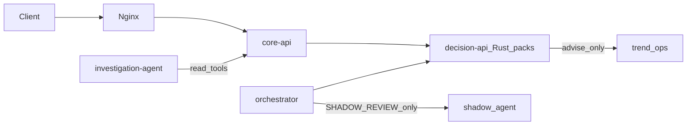

# Architecture

Tarka is a modular fraud stack. Day-1 deploy is **core-api** (decision-api + case-api in one process). Authoritative decisions come from **Rust JSON packs** (`tarka_rule_engine`) inside decision-api.

For end-to-end feature diagrams (evaluate, ingest→Shadow, cases/SAR, trend, investigation), see **[Feature data flows](guides/feature-data-flows.md)**.

---

## Authority

| Surface | Role |
|---------|------|
| decision-api evaluate | **Allow / deny / flag / review** |
| Shadow / trend / investigation-agent | Advise, escalate, draft, cite — never silent FLAG→ALLOW |

---

## Major components

| Component | Role |
|-----------|------|
| **core-api** | Macroservice: `/decisions` + `/cases` |
| **decision-api** | Evaluate pipeline, rules/GitOps, depth fusion, trend APIs, vendors |
| **orchestrator** | TransactionSchema ingest → evaluate → optional Shadow |
| **shadow_agent** | Local-first forensics LLM (Ollama/OpenAI-compatible) |
| **investigation-agent** | Analyst copilot + AgentRun |
| **graph-service** | Entity graph HTTP; orchestrator GraphClient (Janus/Neo4j) |
| **signal-api** | Features + ML under one plane |
| **integration-ingress** | OSINT, sanctions, Integration Hub, vault/KMS |
| **data-plane** | Async ingest + analytics sink |
| **frontend** | Analyst SPA; nginx gateway |

Legacy Python `rule_engine` HTTP evaluate is dual-run / compatibility only (`RULE_ENGINE_ALLOW_DEMO_FALLBACK` gated).

---

## Data stores

| Store | Use |
|-------|-----|
| PostgreSQL | Cases, SAR, audit-oriented SoR, feature definitions |
| Redis | Tags, velocities, telemetry dual-write |
| JanusGraph / Neo4j | Topology; Neo4j preferred for usable `get_graph_signals` |
| ClickHouse / DuckDB | Analytics KPIs (503 when offline) |
| NATS JetStream | Async workers |
| SQLite | Trend agent store; Shadow audit (sidecar) |

---

## Compose

| File | When |
|------|------|
| `infra/deploy/docker-compose.lite.yml` | Desk / try-it |
| `…/docker-compose.fraud-desk.yml` | Lean nav + desk-strict |
| `…/docker-compose.v2-ingest.yml` | Ingest + Shadow |
| `--profile trend-tick` | Always-on trend drafts |
| `--profile graph` | Gremlin + graph-service |

Gateway map: `frontend/nginx.conf`.

---

## Honesty

See [`docs/STUB_REGISTER.md`](../STUB_REGISTER.md) and [productionization runbook](guides/repo-productionization-runbook.md).
