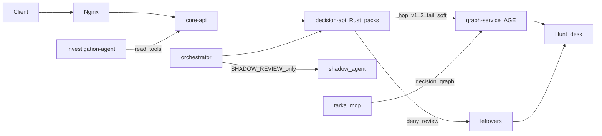

# Architecture

Tarka is a local-first fraud OS. Day-1 deploy is **core-api** (decision-api + case-api in one process). Authoritative decisions come from **Rust JSON packs** (`tarka_rule_engine`) inside decision-api. Product vision is evaluate-first — see [`VISION.md`](../../VISION.md).

For end-to-end feature diagrams (evaluate hop, leftovers/Hunt, ingest→Shadow, trend, investigation), see **[Feature data flows](guides/feature-data-flows.md)**.

---

## Authority

| Surface | Role |
|---------|------|
| decision-api evaluate | **Allow / deny / flag / review** |
| graph-service (AGE) | Hop + Hunt + Decision vertices. Never overrides policy |
| leftovers / Hunt | Residual station. ALLOW never becomes a leftover |
| Shadow / trend / investigation | Advise, escalate, draft, cite — never silent FLAG→ALLOW |
---

## Major components

| Component | Role |
|-----------|------|
| **core-api** | Macroservice: `/decisions` + `/cases` |
| **decision-api** | Evaluate pipeline, rules/GitOps, depth fusion, trend APIs, vendors |
| **orchestrator** | TransactionSchema ingest → evaluate → optional Shadow |
| **shadow_agent** | Local-first forensics LLM (Ollama/OpenAI-compatible) |
| **investigation-agent** | Pack-why on evaluate-born residual cases; copilot + AgentRun |
| **graph-service** | Hop v1.2 + Hunt. Lite default: Apache AGE on the same Postgres. Janus / Neo4j optional overlays. Decision-context SQLite SoR. |
| **tarka_mcp** | Stdio MCP over the decision graph. Optional IDE plane. |
| **signal-api** | Features + ML under one plane |
| **integration-ingress** | OSINT, sanctions, Integration Hub, vault/KMS |
| **data-plane** | Async ingest + analytics sink |
| **frontend** | Analyst SPA; nginx gateway. Lean home is Hunt `/graph` when the graph URL is set. |

Legacy Python `rule_engine` HTTP evaluate is dual-run / compatibility only (`RULE_ENGINE_ALLOW_DEMO_FALLBACK` gated).

---

## Data stores

| Store | Use |
|-------|-----|
| PostgreSQL + Apache AGE | Cases, leftovers, SAR, audit, lite graph (`GRAPH_BACKEND=age`) |
| Redis | Tags, velocities, telemetry dual-write |
| JanusGraph / Neo4j | Optional topology overlay (`--profile graph` + graph-wire). Not Day-1. |
| ClickHouse / DuckDB | Analytics KPIs (503 when offline) |
| NATS JetStream | Async workers |
| SQLite | Decision-context SoR (`decision_context.sqlite`); trend agent store; Shadow audit (sidecar) |

---

## Compose

| File | When |
|------|------|
| `infra/deploy/docker-compose.lite.yml` | Day-1: evaluate + AGE + graph-service |
| `…/docker-compose.fraud-desk.yml` | Hunt `/graph`, leftovers, `/ops/shadow` |
| investigation / signals overlays | Advise / features. See [SRE compose profiles](operations/sre-compose-profiles.md) |
| `--profile trend-tick` | Always-on trend drafts |
| `--profile graph` + graph-wire | Janus/Gremlin overlay (optional; AGE already on lite) |
| `…/docker-compose.v2-ingest.yml` | Lab ingest + Shadow. Not Day-1 |

Gateway map: `frontend/nginx.conf`.
