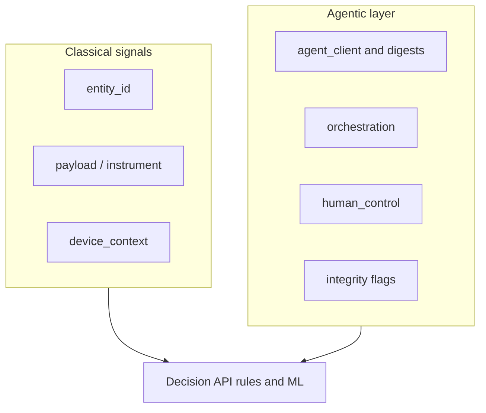

# Agentic AI fraud detection: variables and layering

This guide operationalizes how to think about **fraud signals** when an LLM agent sits between a user and transactional systems. It complements the conceptual framing in product discussions: **task labels** (for example “buy groceries”) are weak discriminators; **entities**, **instruments**, **events**, and **deviation from per-user baselines** are not.

The tables below map **signal ownership** (what Tarka and its deployers own versus partners), an **orchestration telemetry inventory** aligned with this repository’s services, and **baseline plus step-up** guidance for sensitive actions.

---

## 1) Classical signals: ownership (Tarka vs tenant vs partners)

Use this to avoid duplicating vendor scope, to contract clearly, and to route features to the right service.


| Signal category           | Examples                                                                           | Typically owned by **tenant / merchant**                         | Typically **card network / issuer / wallet**                   | **Tarka OSS** role (how it fits)                                                                                                                                                                                                   |
| ------------------------- | ---------------------------------------------------------------------------------- | ---------------------------------------------------------------- | -------------------------------------------------------------- | ---------------------------------------------------------------------------------------------------------------------------------------------------------------------------------------------------------------------------------- |
| **Payment instrument**    | BIN, AVS/CVV outcomes, 3DS challenge vs frictionless, authorization response codes | Merchant vault tokenization choices, checkout UX, routing to PSP | Authorization decision, issuer risk, SCA rules                 | Ingest instrument-related fields as **features** on `payment` events via [Decision API](../services/decision-api.md) payloads; persist outcomes for replay and batch labeling. Tarka does not replace the issuer.                  |
| **Account / identity**    | KYC tier, account age, recovery flows, prior disputes                              | IAM, CRM, onboarding vendor                                      | Issuer “trusted beneficiary” style programs (indirect)         | [Integration Ingress](../projects/integration-ingress-project.md) for adapter-style webhooks (KYC/sanctions); [Case API](../services/case-api.md) for investigation state—not a system of record for core banking identity.        |
| **Device & session**      | Fingerprint, VPN/datacenter flags, webdriver/headless hints                        | App/SDK instrumentation, device intelligence vendors             | EMV 3DS device binding where applicable                        | [Decision API](../services/decision-api.md) `device_context` and `metadata` (IP, user agent); mobile docs such as [mobile attestation taxonomy](mobile-attestation-taxonomy.md). Tenant supplies signals; Tarka scores and audits. |
| **Graph / linkage**       | Shared cards, devices, addresses across `entity_id`s                               | Entity identifiers and event graph policy                        | Consortium / network fraud exchanges (optional external feeds) | [Graph Service](../services/graph-service.md) for entity resolution and community detection; ingest edges from your events.                                                                                                        |
| **Velocity & aggregates** | Counts and sums per entity, session, instrument                                    | Feature definitions for “normal” per product                     | Network velocity (not directly exposed to all merchants)       | [Feature Service](../projects/feature-service-project.md), Redis-backed tags, [Event Ingest](../guides/ingest-replay-onboarding.md) async path for high volume.                                                                    |
| **Model scores**          | Custom rules, ONNX models, ensembles                                               | Feature engineering ownership                                    | N/A                                                            | [ML Scoring](../services/ml-scoring.md), JSON rules, optional OPA in Decision API pipeline.                                                                                                                                        |


**Practical split**

- **Partners / issuers**: final say on **authorization**, **SCA**, and many **instrument** outcomes; Tarka consumes outcomes as **inputs** to rules and ML.
- **Tenant**: **identity**, **checkout**, **device collection**, **business policy** (what is “sensitive”), and **labels** for supervised learning.
- **Tarka**: **decision orchestration**, **graph analytics**, **case and audit workflows**, **investigation copilot** tooling—with clear boundaries documented in [Investigation Copilot — intended use](investigation-agent-intended-use-and-data-flows.md).

---

## 2) Orchestration telemetry: events to log

Agentic fraud detection needs **structured** records of **what ran**, **in what order**, and **whether execution matched intent**. Use these categories when instrumenting or reviewing observability.

### 2.1 Core event dimensions (all agent surfaces)


| Field / concept                        | Purpose                                                                                              |
| -------------------------------------- | ---------------------------------------------------------------------------------------------------- |
| `tenant_id`, `entity_id`, `session_id` | Tie agent activity to scoring and graph ([Decision API](../services/decision-api.md) request shape). |
| `correlation_id` / `trace_id`          | Join browser → API → tool → payment authorization.                                                   |
| `event_type`                           | Distinguish `payment`, `login`, `session`, `custom` for downstream rules.                            |
| Client surface                         | `web` vs `server` vs embedded plugin—detect cross-channel mismatch.                                  |


### 2.2 Tool loop and HTTP tool calls (investigation / copilot)

Log one structured record per **tool invocation** (name, args hash or redacted args, latency, HTTP status, error class, retry count).


| Telemetry                             | What it enables                                                                                        |
| ------------------------------------- | ------------------------------------------------------------------------------------------------------ |
| **Tool name sequence**                | Rare order vs user baseline (for example `get_case` → `subgraph` vs immediate `ingest_labeled_rows`).  |
| **Retries and backoff**               | Scripted abuse and injection-driven loops versus normal analyst correction.                            |
| **Tool errors vs model continuation** | Correlate with assurance/refusal policies ([assurance modes](investigation-agent-assurance-modes.md)). |
| **Depth and fan-out**                 | Number of tools per turn; unusual breadth before a sensitive tool.                                     |


Implementation touchpoints in this repo: investigation-agent tools (`services/investigation-agent/.../tools.py`), structured logs/metrics mentioned in [intended use](investigation-agent-intended-use-and-data-flows.md).

### 2.3 Plan vs execution (semantic consistency)


| Check                          | Notes                                                                                                                                              |
| ------------------------------ | -------------------------------------------------------------------------------------------------------------------------------------------------- |
| **Stated plan vs API payload** | If the UI or agent “plan” is logged, hash or summarize it and compare to downstream `payment` / `custom` event payloads (amount, payee, shipping). |
| **Approval gates**             | Sensitive tools should align with [review and maker–checker](enterprise-copilot-plugin-and-governance-controls.md) metadata when enabled.          |


### 2.4 Ingest for async and replay


| Path                                                              | Use                                                                                         |
| ----------------------------------------------------------------- | ------------------------------------------------------------------------------------------- |
| [Event Ingest](ingest-replay-onboarding.md) → NATS → Decision API | High-volume **transactional** and **custom** agent events with idempotency keys for replay. |
| Analytics sink / ClickHouse                                       | Longitudinal analytics on orchestration metrics (see [architecture](../architecture.md)).   |


### 2.5 Prompt-injection and untrusted content


| Signal                                                     | Why                                                                                                                                      |
| ---------------------------------------------------------- | ---------------------------------------------------------------------------------------------------------------------------------------- |
| Source of user text (email paste, web scrape, ticket body) | Correlate with spikes in sensitive tool use or payment events.                                                                           |
| Sanitization / reject outcomes                             | Documented heuristics in [intended use](investigation-agent-intended-use-and-data-flows.md)—log policy decisions, not just model output. |


---

## 3) Per-user baselines and step-up triggers

Layer **classical** fraud controls first; use **agent-specific** signals as boosters tied to **personal baselines**, not global “automation = bad” rules.

### 3.1 Baseline dimensions (examples)

Define, per `entity_id` (and optionally per instrument or device):

- **Typical** payment amounts, merchants or MCCs, hours, and geos.
- **Typical** agent usage: tools per session, sessions per week, sensitive-tool frequency for that role.
- **Typical** device posture: stable `device_id`, attestation history.

Store rolling features in your feature pipeline ([Feature Service](../projects/feature-service-project.md), Redis tags) and feed [Decision API](../services/decision-api.md).

### 3.2 Step-up triggers (illustrative)

Adjust thresholds to your risk appetite; these are **patterns**, not prescribed defaults.


| Trigger                                            | Example response                                                                                                                  |
| -------------------------------------------------- | --------------------------------------------------------------------------------------------------------------------------------- |
| New device + high value + new payee                | Step-up auth, 3DS, delay, or manual review case.                                                                                  |
| Orchestration anomaly + instrument risk            | Raise score; route to `review`; attach graph context.                                                                             |
| Sensitive tool or export (when product defines it) | Require **maker–checker** or reviewer secret ([enterprise Copilot plugin](enterprise-copilot-plugin-and-governance-controls.md)). |
| Repeated tool failures then payment attempt        | Block or challenge—possible scripted card testing.                                                                                |


### 3.3 Governance hooks already in this codebase

Wire operational policy to these controls where applicable:

- `COPILOT_MAKER_CHECKER_REQUIRED`, `COPILOT_REVIEWER_SECRET`, `COPILOT_DISABLED_TOOLS`, `sensitive_tool_gate_enabled` — see [Enterprise Copilot plugin + governance](enterprise-copilot-plugin-and-governance-controls.md).
- `COPILOT_ASSURANCE_MODE=strict` — refusal when machine checks fail ([assurance modes](investigation-agent-assurance-modes.md)).

### 3.4 Limitation

A patient attacker with a **strong stolen instrument** and **coherent digital identity** can still pass—**agentic AI does not remove** that ceiling. Investment belongs in **issuer authentication**, **step-up**, **telemetry**, and **graph plus case** workflows—not in banning “shopping” tasks.

---

## 4) `agent_context` on evaluate: reasoning

1. **Separation of concerns**: Classical fraud features stay on `entity_id`, instrument fields in `payload`, and `device_context`. `**agent_context`** records *how* the action was mediated (registered client, tool loop, human approval)—without overloading payment semantics in `payload`.
2. **Auditability**: Investigations can show **which software** initiated the request, **whether HITL/maker–checker** applied, and **hashes** of manifests and tool sequences—without storing raw prompts in the transactional event (prefer hashes; see [Enterprise Copilot plugin + governance](enterprise-copilot-plugin-and-governance-controls.md)).
3. **Correlation**: Use `metadata.correlation_id` with `**agent_session_id`** to join browser, MCP, and authorization steps in one timeline.
4. **Risk is not “automation = bad”**: Tiered criteria in [section 6](#6-agentic-risk-tiers-policy-inputs) reward **registered clients** and **narrow allowlists** while boosting **unknown clients**, **injection heuristics**, and **cross-channel mismatch**.

**Server behavior (Decision API)**: When `agent_context` is present, it is merged into the **rule feature map** under the key `agent_context` (nested object) and included in the **audit snapshot** (subject to regional PII masking). See [Decision API](../services/decision-api.md) and [contracts/openapi/decision-api.yaml](../../../contracts/openapi/decision-api.yaml).

---

## 5) Concrete event schema (`agent_context`)

Optional top-level field on `POST /v1/decisions/evaluate` (same shape can be sent on async ingest bodies that forward to evaluate—see [ingest-replay-onboarding](ingest-replay-onboarding.md); Event Ingest forwards all keys except `_ingest_id`).

```json
{
  "tenant_id": "acme",
  "event_type": "payment",
  "entity_id": "user-42",
  "session_id": "sess-abc123",
  "payload": { "amount": 10, "currency": "USD" },
  "device_context": { "device_id": "d-xxxx", "platform": "web", "signals": {} },
  "metadata": { "correlation_id": "trace-9f3c...", "ip": "203.0.113.42" },
  "agent_context": {
    "agent_runtime_id": "550e8400-e29b-41d4-a716-446655440000",
    "agent_session_id": "asess-01JABC",
    "agent_client": {
      "client_type": "mcp",
      "oauth_client_id": "client-registered-123",
      "mcp_server_ids": ["payments-mcp.prod"],
      "manifest_hash": "sha256:...",
      "tool_allowlist_hash": "sha256:...",
      "sdk_version": "tarka-sdk/1.2.3"
    },
    "human_control": {
      "hitl_required_for_event": true,
      "human_approval_received": true,
      "approver_entity_id": "analyst-7",
      "maker_checker_satisfied": true
    },
    "orchestration": {
      "turn_id": "turn-uuid",
      "tool_names_ordered": ["get_case", "subgraph"],
      "tool_sequence_digest": "sha256:...",
      "tool_depth": 2,
      "tool_retry_count": 0,
      "plan_digest": "sha256:...",
      "untrusted_content_sources": []
    },
    "integrity": {
      "prompt_injection_heuristic_flag": false,
      "cross_channel_mismatch_flag": false,
      "policy_denial_count_this_session": 0
    }
  }
}
```

### Field reference


| Field                                                | Purpose                                                                                |
| ---------------------------------------------------- | -------------------------------------------------------------------------------------- |
| `metadata.correlation_id`                            | End-to-end trace across services (works with or without `agent_context`).              |
| `agent_runtime_id`                                   | Stable-ish id for this **installed** agent runtime (rotates on reinstall).             |
| `agent_session_id`                                   | **Ephemeral** MCP or conversation session; ties multiple tool calls.                   |
| `agent_client.oauth_client_id`                       | **Registered** OAuth client when applicable—`null`/missing increases tiered risk.      |
| `agent_client.manifest_hash` / `tool_allowlist_hash` | Detect capability drift vs tenant allowlist.                                           |
| `human_control.`*                                    | Aligns with maker–checker and sensitive-tool governance.                               |
| `orchestration.tool_sequence_digest`                 | Hash of ordered tools (and coarse arg classes)—not raw PII.                            |
| `orchestration.untrusted_content_sources`            | Tags (e.g. `email_body`, `web_page`) when untrusted content was near a sensitive step. |
| `integrity.`*                                        | Upstream heuristics (gateway/copilot); **weak learners** for rules/ML.                 |


### Graph (optional)

For investigations only: edges such as `(entity_id)-[:AGENT_SESSION]->(agent_session_id)` and `(agent_session_id)-[:USES_CLIENT]->(oauth_client_id)`—not cryptographic proof of end-user intent.




---

## 6) Agentic risk tiers (policy inputs)

Use as **inputs** to rules and scores (boost `review`, step-up auth, etc.), **not** as the only signal. Combine with **instrument** and **issuer** outcomes.

### Lower risk (well-governed agent use)


| Requirement                                                                                                                            | Rationale                                       |
| -------------------------------------------------------------------------------------------------------------------------------------- | ----------------------------------------------- |
| `oauth_client_id` matches a **tenant-registered** allowlist                                                                            | Reduces anonymous or trojaned clients.          |
| `manifest_hash` / `tool_allowlist_hash` match **known good** for that client                                                           | Detects tampering or drift.                     |
| `device_context` with stable `device_id` or strong **attestation**                                                                     | Binds action to an enrolled device.             |
| For sensitive events: `human_approval_received` and `maker_checker_satisfied` when policy requires                                     | Evidence of HITL.                               |
| `integrity.prompt_injection_heuristic_flag` false; `untrusted_content_sources` empty or no sensitive mutation in same `correlation_id` | Injection not co-occurring with money movement. |
| `integrity.cross_channel_mismatch_flag` false                                                                                          | Consistent identity posture across channels.    |
| Moderate `tool_depth`, low `tool_retry_count`, stable `policy_denial_count_this_session`                                               | Matches steady copilot or analyst baseline.     |


### Medium risk (elevated scrutiny)


| Indicator                                                                      | Typical response                               |
| ------------------------------------------------------------------------------ | ---------------------------------------------- |
| New `oauth_client_id` or new `manifest_hash` for this `entity_id` recently     | Review or step-up.                             |
| High `tool_retry_count` or error–repair loops before payment                   | Possible scripting or injection-driven repair. |
| Non-empty `untrusted_content_sources` with payout/shipping change in `payload` | Boost injection-related score.                 |
| VPN/datacenter without prior baseline                                          | Combine with classical device risk.            |
| `hitl_required_for_event` true but approval fields missing                     | Block or force review.                         |


### Higher risk (strong boosters)


| Indicator                                                                                             | Typical response               |
| ----------------------------------------------------------------------------------------------------- | ------------------------------ |
| Money movement with missing `oauth_client_id` and unknown `client_type`                               | High score; challenge.         |
| `prompt_injection_heuristic_flag` true and sensitive financial change under same `correlation_id`     | Strong booster; manual review. |
| `cross_channel_mismatch_flag` true with high value or new payee                                       | Step-up authentication.        |
| Rapid permission expansion (new `mcp_server_ids`, manifest change) with first-time high-value payment | Possible ATO or malware.       |
| Very high `tool_depth`, many denials, then payment success                                            | Automated probing pattern.     |


---

## Related docs

- [Architecture](../architecture.md)
- [Decision API](../services/decision-api.md)
- [Graph analysis](graph-analysis.md)
- [Investigation agent LLM data flow](investigation-agent-llm-data-flow.md)

