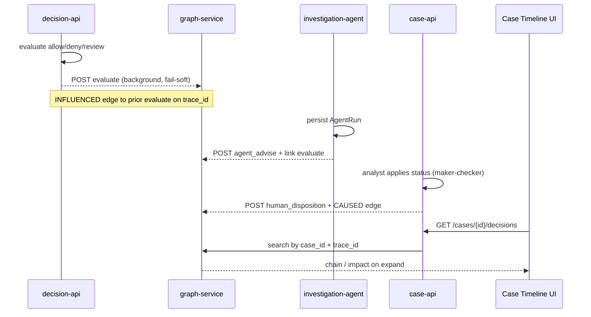

# Decision context graph

Tarka records **decisions as durable objects** — not just logs — so you can answer months later: *what did we decide, why, what influenced it, and what happened next?*

Native SoR on graph-service; optional mirror sidecar behind feature flags.

**Full guide:** this document · **Spec:** [`docs/superpowers/specs/2026-08-17-decision-context-graph-design.md`](../../superpowers/specs/2026-08-17-decision-context-graph-design.md)

---

## Problem

| Layer | Answers |
|-------|---------|
| Traces / LLM logs | What ran during one request |
| AuditLog | What the rule engine emitted |
| **Decision graph** | What the **system decided** (evaluate, agent advise, human disposition), causal links, invalidation |

Observability is execution-centric. The decision graph is **domain-centric** — the same question regulators ask: *show the decision chain without replaying the model.*

---

## Architecture

```
evaluate (decision-api)     ──fail-soft──► graph-service SQLite SoR
AgentRun (investigation)    ──fail-soft──►     + optional Janus mirror
case disposition (case-api) ──fail-soft──►     + optional Semantica sidecar
```

**Authority:** Rust / decision-api remains sole **allow/deny**. The graph never overrides policy.

**SoR:** SQLite at `DECISION_GRAPH_DB_PATH` (default under `GRAPH_DATA_DIR/decision_context.sqlite`). Janus `Decision` vertices are an optional UX mirror (`DECISION_GRAPH_JANUS_MIRROR=1`).

### End-to-end flow (one investigation)



**Example chain** (same trace):

| Step | kind | outcome | Edge to parent |
|------|------|---------|----------------|
| 1 | `evaluate` | `review` | — |
| 2 | `agent_advise` | cluster summary | `INFLUENCED` ← evaluate |
| 3 | `human_disposition` | `escalated` | `CAUSED` ← agent_advise |

Invalidation: `POST /v1/decisions/{id}/invalidate` sets `invalidated_at`; optional `supersede_to` adds a `SUPERSEDES` edge. History remains queryable for audit.

---

## Decision kinds

| `kind` | Writer | Example `outcome` |
|--------|--------|-------------------|
| `evaluate` | Post-evaluate background task | `allow`, `review`, `deny` |
| `agent_advise` | AgentRun persist (chat/shadow/trend) | claim text / `advise` |
| `human_disposition` | Case status apply (maker-checker) | `escalated`, `resolved` |
| `policy_gate` | (reserved) | deterministic gate id |

Each record has: `scenario`, `reasoning` (defendable only — no hidden CoT), `rule_ids`, `trace_id`, `case_id`, `entity_external_ids`, `evidence_ids`, `audit_log_id`, `agent_run_id`, `shadow`, `invalidated_at`.

---

## Causal edges

| Relationship | Meaning |
|--------------|---------|
| `INFLUENCED` | Soft parent → child (e.g. prior evaluate → new evaluate on same trace) |
| `CAUSED` | Hard parent → child (e.g. agent advise → human confirms status) |
| `SUPERSEDES` | Replacement decision invalidates an older one |
| `PRECEDENT_FOR` | Explicit precedent link (search/filter first; embeddings later) |
| `BASED_ON` | Decision → entity id (subjects considered) |

**Auto-linking (no manual ids required):**

1. **Evaluate** → latest prior `evaluate` on same `trace_id`
2. **AgentRun** → latest `evaluate` on trace from context snapshot
3. **Human disposition** → latest `agent_advise` on case, else evaluate on trace; optional `agent_run_id` on PATCH body

---

## HTTP API (graph-service)

| Method | Path | Purpose |
|--------|------|---------|
| POST | `/v1/decisions` | Record + optional `edges[]` |
| GET | `/v1/decisions/search` | Filter by tenant, case, trace, kind, entity, text |
| GET | `/v1/decisions/latest` | Newest match |
| GET | `/v1/decisions/{id}` | Get (`include_neighbors=true`) |
| GET | `/v1/decisions/{id}/chain` | Causal parents |
| GET | `/v1/decisions/{id}/impact` | Blast radius (downstream) |
| POST | `/v1/decisions/{id}/invalidate` | Soft invalidate + optional `supersede_to` |

Case-api proxies for the desk:

- `GET /v1/cases/{case_id}/decisions`
- `GET /v1/cases/{case_id}/decisions/{id}/chain`
- `GET /v1/cases/{case_id}/decisions/{id}/impact`

Evidence bundle includes `decision_context` (`tarka.decision_context/v1`).

OpenAPI: `contracts/openapi/graph-service.yaml`

---

## Enable (Compose)

With graph profile:

```bash
docker compose \
  -f infra/deploy/docker-compose.lite.yml \
  -f infra/deploy/docker-compose.graph-wire.yml \
  --profile graph up --build
```

Required env (set in `docker-compose.graph-wire.yml`):

| Variable | Service | Purpose |
|----------|---------|---------|
| `DECISION_GRAPH_ENABLED=1` | graph-service, core-api, investigation-agent | Turn on store + writers |
| `GRAPH_SERVICE_URL=http://graph-service:8001` | core-api, case-api path, investigation-agent | Client target |
| `GRAPH_DATA_DIR=/var/tarka-graph` | graph-service | Persist SQLite volume |
| `SEMANTICA_BRIDGE_ENABLED=0` | graph-service | Optional mirror (off by default) |
| `DECISION_GRAPH_JANUS_MIRROR=0` | graph-service | Optional Janus Decision vertices |

Desk-only (no graph): decision graph writers no-op safely (`DECISION_GRAPH_ENABLED=0`).

---

## MCP (agents / Cursor)

Stdio server wrapping graph HTTP:

```bash
export GRAPH_SERVICE_URL=http://127.0.0.1:8001
export DECISION_GRAPH_ENABLED=1
PYTHONPATH=services python -m tarka_mcp
```

Tools: `record_decision`, `get_decision_chain`, `get_decision_impact`, `find_precedent_decisions`.

See [`services/tarka_mcp/README.md`](../../../services/tarka_mcp/README.md).

---

## Desk UI

Case workbench → **Timeline** tab → **Decision accountability** panel lists decisions for the case/trace; expand **Chain** or **Impact** per row.

---

## Compliance export

```bash
# W3C PROV-O JSON-LD
python3 scripts/compliance/export_decision_prov.py --tenant acme --output decisions.json

# Golden chain smoke (evaluate → advise → disposition)
python3 scripts/oss/decision_context_chain_smoke.py
```

---

## Semantica sidecar (optional)

`services/semantica-bridge/` mirrors native records when `SEMANTICA_BRIDGE_ENABLED=1` and `SEMANTICA_PIN` is set. Stub backend works offline for demos. **Never** on the evaluate allow/deny path.

---

## Code map

| Path | Role |
|------|------|
| `services/graph-service/src/graph_service/decision_context_store.py` | SQLite SoR |
| `services/graph-service/src/graph_service/decision_context_api.py` | HTTP |
| `packages/shared-core/tarka_shared/decision_graph_client.py` | Fail-soft HTTP client |
| `packages/shared-core/tarka_shared/decision_graph_payload.py` | Shared writer payloads |
| `services/decision-api/.../decision_outcome.py` | Evaluate writer |
| `services/investigation-agent/.../agent_run_store.py` | Agent advise writer + `decision_external_id` |
| `services/case-api/.../decision_context_proxy.py` | Desk proxies + bundle snapshot |
| `services/tarka_mcp/` | MCP tools |
| `services/semantica-bridge/` | Optional mirror |

---

## Philosophy

- Fail-soft writers — evaluate/ingest never fails because graph is down
- AI never auto-resolves cases via the graph
- `reasoning` field = evidence you would defend to an auditor, not model chain-of-thought
- Invalidation is soft-delete + optional supersede — history remains queryable
