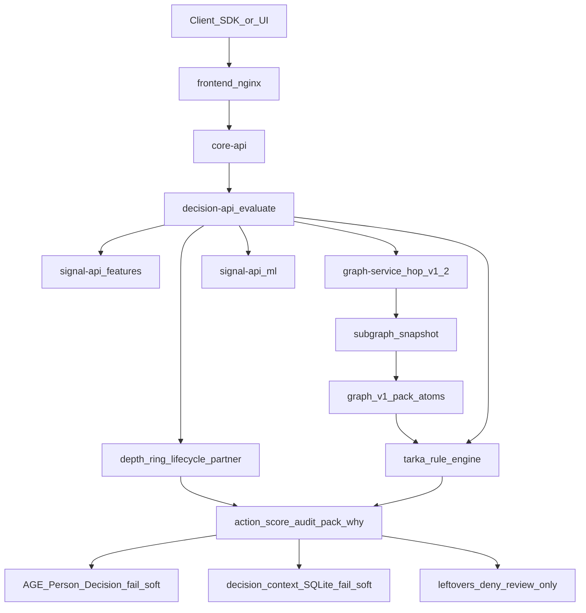
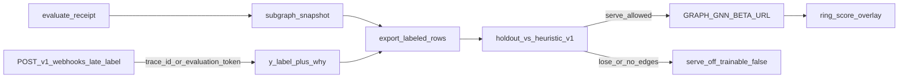
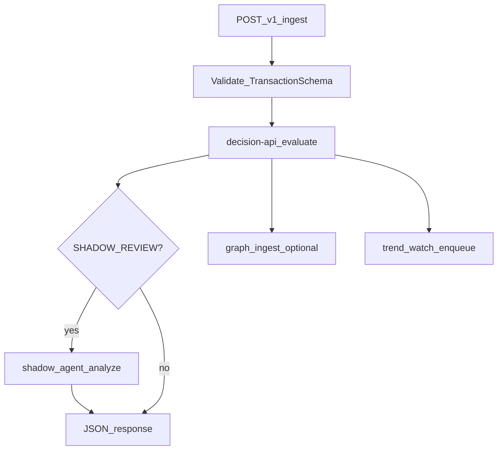
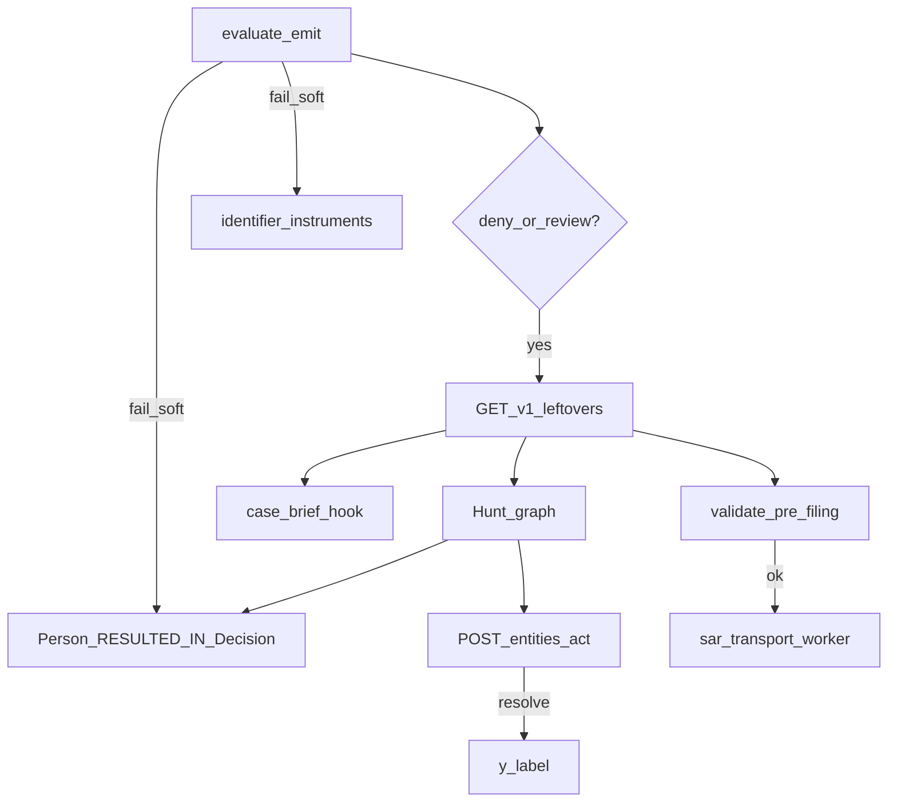
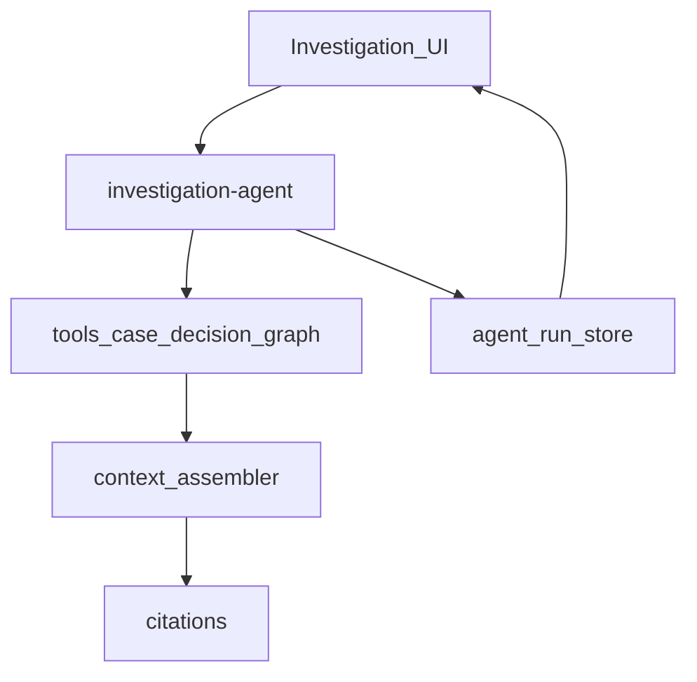
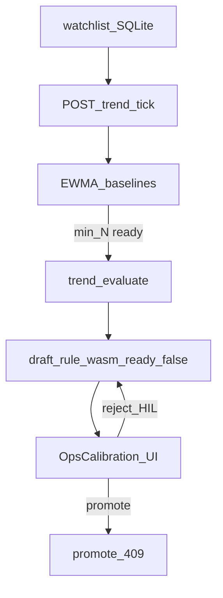
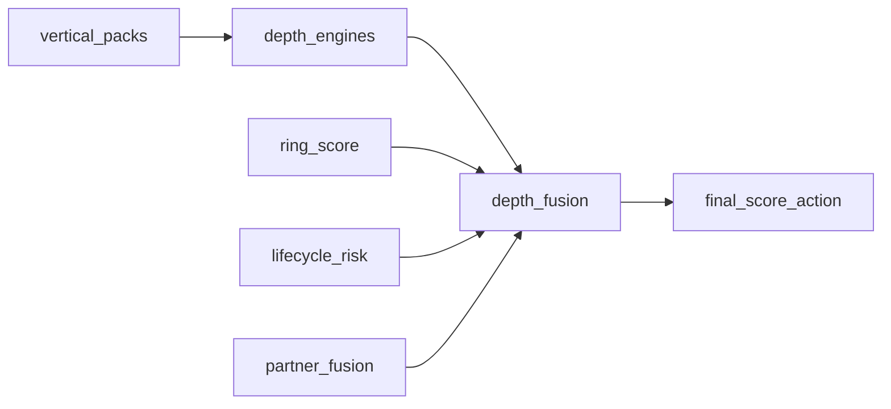

# Feature data flows

How product features move data, who **decides**, and how outcomes affect downstream systems.

**Authority invariant:** `decision-api` (Rust JSON packs via `tarka_rule_engine`) owns allow / deny / flag / review actions. Advise (Shadow agent), investigation, and trend **advise**, escalate, draft, and cite — they never silently clear FLAG→ALLOW or auto-promote WASM.
Related: [repo-productionization-runbook](repo-productionization-runbook.md) · architecture canvas (IDE).

---

## 1. Synchronous evaluate (authoritative)

Analyst UI / SDK / merchant → nginx → **core-api** `/decisions` → **decision-api** evaluate pipeline.

Graph is a **hop**, not a hint blob. Identity is hop v1.2 `(tenant_id, vtype, id)`. Named edges stay named (`USES_DEVICE`, not rewritten to `RELATED`). Empty `GRAPH_SERVICE_URL` tags `graph:missing` / `graph:unconfigured` — packs that need hops do not fire; neighbors are not invented. Evaluate never waits on graph.

| Stage | Data in | Data out | Decision effect |
|-------|---------|----------|-----------------|
| Lists / tags | entity, tenant | whitelist/blacklist tags | Hard short-circuit possible |
| Features / ML | entity window | velocity, scores | Inputs to packs + fusion |
| Prior labels | `y_label` store | `label_delta` | Live score adjust; not allow/deny |
| Graph hop | Person / Device / instruments | named edges, hop view | `graph_v1` atoms (e.g. signed `USES_DEVICE` + multi-id / sibling) |
| Snapshot | hop that was actually returned | `subgraph_snapshot` + receipt | Replay / late-label / GNN export. Empty URL ⇒ `graph:missing` |
| Rules | packs + AST + hop atoms | hit list, pack-why, base action | Primary policy |
| Depth / ring / lifecycle / partner | vertical evidence | fused deltas | Adjust score / escalate. GNN overlay off unless holdout wins |
| Emit | — | `recommended_action`, audit, `trace_id` | Leftovers / Hunt / webhooks react |

**Downstream of action:**

- `allow` — continue; fail-soft AGE Decision hop (rolling cap of 20 allow Decisions per Person). No leftover.
- `flag` — receipt + pack-why. No leftover.
- `review` / `deny` — leftover mint (`origin:evaluate`) + AGE `Person -RESULTED_IN-> Decision` + SQLite decision-context write (both fail-soft)
- `SHADOW_REVIEW` — orchestrator may call Shadow (ingest path)
- `block` / hold — enforcement adapters + audit

See also [decide-to-act-enforcement](decide-to-act-enforcement.md) · [decision-context-graph](decision-context-graph.md) · [gnn-label-loop](gnn-label-loop.md).

### Late label and GNN (offline)

Chargeback is a late label on the evaluate receipt, not a CRM. Serve stays off unless holdout beats `heuristic_v1`.

Webhook binds `dispute_outcome` + `chargeback_class` (`FRAUD` / `FRIENDLY` / `SERVICE` / `UNKNOWN`) to the original receipt. It does not reconstruct features. No snapshot ⇒ label still recorded, `trainable: false`. Overlay never allow/denies. Lite compose must keep `GRAPH_GNN_BETA_URL` unset.

---

## 2. Orchestrator ingest → decide → Shadow (v2)

| Knob | Effect |
|------|--------|
| `RULE_EVAL_BACKEND=decision_api` | Authoritative evaluate |
| `SHADOW_ACTION_MODULATION=escalate_only` | Shadow cannot clear to ALLOW |
| `TREND_WATCH_ON_INGEST=1` | Fire-and-forget watchlist upsert |
| Graph `signals_usable=false` | Omitted from Shadow context (no fake zeros) |

Compose (lab, not Day-1): `infra/deploy/docker-compose.v2-ingest.yml` (also under `infra/deploy/archive/`).

---

## 3. Leftovers, Hunt, brief, SAR

Work **arrives** on `GET /v1/leftovers` (desk `/leftovers`). Work **happens** on Hunt (`/graph`). Hold / release / resolve are Person acts (`POST /v1/entities/{id}/act`). Fat `/cases` stays hidden in lean; CaseDetail is SAR / dispute / QA.

A leftover is an open/investigating case with `entity_id` and label `act:hold` or `origin:evaluate`. `flag` and `allow` never mint leftovers. Evaluate mint on deny/review by default (`CASE_CREATE_ON_DENY_REVIEW` is opt-out).

Observe `/ops/shadow` folds leftover cost + leftover-extra helpfulness into Promote, and names a live `rule_id` that is slipping (`live_rule_slip`). A slip ping does not demote live. One leftover cannot Promote.

| Feature | Flow | Decision coupling |
|---------|------|-------------------|
| Leftover open | Evaluate mint (deny/review) or Hunt Hold | `origin:evaluate` / `act:hold` |
| Hunt hop | Person → Decision (`RESULTED_IN`); Decision → Payment/Login/Device/… (`BASED_ON`) | Story prefers hop outcome; audit is fallback |
| Instruments | email / phone / document / card / address | Search keys live on the instrument; later evaluate cannot steal a mailbox |
| Hunt act | Hold / release / resolve on the Person | `last_act` + leftover claim; resolve writes `y_label` |
| Observe promote | leftover extras + per-rule FP on `/ops/shadow` | Scout drafts drop when leftovers show they hurt; slip ping does not demote live |
| Case brief | Hook → markdown comment | Rejects `llm_used=true` |
| SAR | Depth-floor XML parse + TIN/report_id | Filing blocked on validation errors |
| Transport | NATS worker | No host ⇒ no fake SFTP success |

---

## 4. Investigation / AgentRun

| Piece | Role vs decisions |
|-------|-------------------|
| Tools | Read case/decision/graph; never overwrite evaluate action |
| Context assembler | Grounds claims to evidence IDs |
| AgentRun | Persisted run for “View run” in Shadow chat rail |
| Offline LLM | Degraded reply — no invented metrics |

Nginx: `/api/investigation/` → investigation-agent.

---

## 5. Trend ops (advise-only)

| Surface | Effect on production policy |
|---------|----------------------------|
| Draft | Advisory package only |
| Promote | **409** `never_auto_promote` |
| Tick skip LLM | Default `TREND_TICK_SKIP_LLM=1` |
| Desk-strict | Trend ops paths need explicit `VITE_USE_API_MOCKS=true` |

Always-on: `make trend-tick` or compose `--profile trend-tick`.

---

## 6. Depth / vertical fusion → score

Sibling bridges (refund/cancel/dispute) are **advisory / fail-soft**: missing URL ⇒ skip, never forge LIVE.

---

## 7. Ingress / OSINT / graph honesty

| Feature | Data path | If unavailable |
|---------|-----------|----------------|
| Sanctions | FtM cache + Postgres logs | Fail-closed logs; fail-soft JSONL mirror |
| OSINT (demo burst) | ingress HTTP | `mode=unavailable` — no canned risk_score |
| Mule path | demo templates | **501** unless `ALLOW_MULE_PATH_DEMO=1` |
| AGE hop (lite default) | graph-service on same Postgres | Evaluate fail-soft (`graph:write_failed` / `graph:missing`). Desk without URL is evaluate-only fallback, not the product |
| Janus / Neo4j overlay | Gremlin / Bolt | Optional. `signals_usable=false` ⇒ Shadow omits; no invented zeros |

---

## 8. Deploy planes (where flows run)

| Compose | Hosts which flows |
|---------|-------------------|
| `docker-compose.lite.yml` | Day-1: core-api + postgres (AGE) + graph-service + redis + frontend |
| `docker-compose.fraud-desk.yml` | Thin desk: Hunt `/graph`, leftovers, `/ops/shadow` |
| investigation / signals overlays | Advise plane / signal-api + ingress (see [SRE compose profiles](../operations/sre-compose-profiles.md)) |
| `--profile graph` + graph-wire | Optional Janus/Gremlin overlay (AGE already on lite) |
| `docker-compose.v2-ingest.yml` | Lab ingest → Shadow. Not Day-1; also under `infra/deploy/archive/` |

Gateway map: [frontend/nginx.conf](../../../frontend/nginx.conf).

---

## Quick matrix: who can change production decisions?

| Actor | Can set allow/deny? | Can open cases? | Can draft rules? | Can file SAR? |
|-------|---------------------|-----------------|------------------|---------------|
| decision-api evaluate | **Yes** | Indirect | No | No |
| Orchestrator | No (forwards) | Via policy hooks | No | No |
| Shadow | No (escalate only) | Suggest | No | No |
| Trend tick | No | No | Draft only | No |
| Investigation | No | Via tools if permitted | No | No |
| Analyst UI (GitOps) | Via promote/approve | Yes | Yes (human) | Yes (human) |
