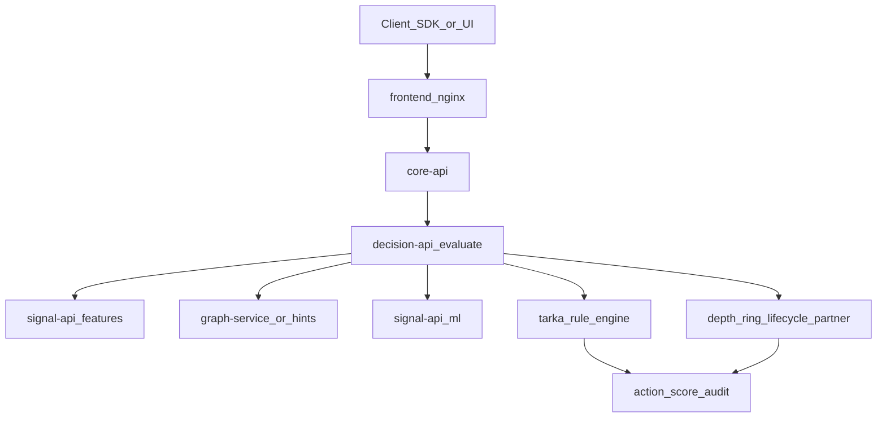
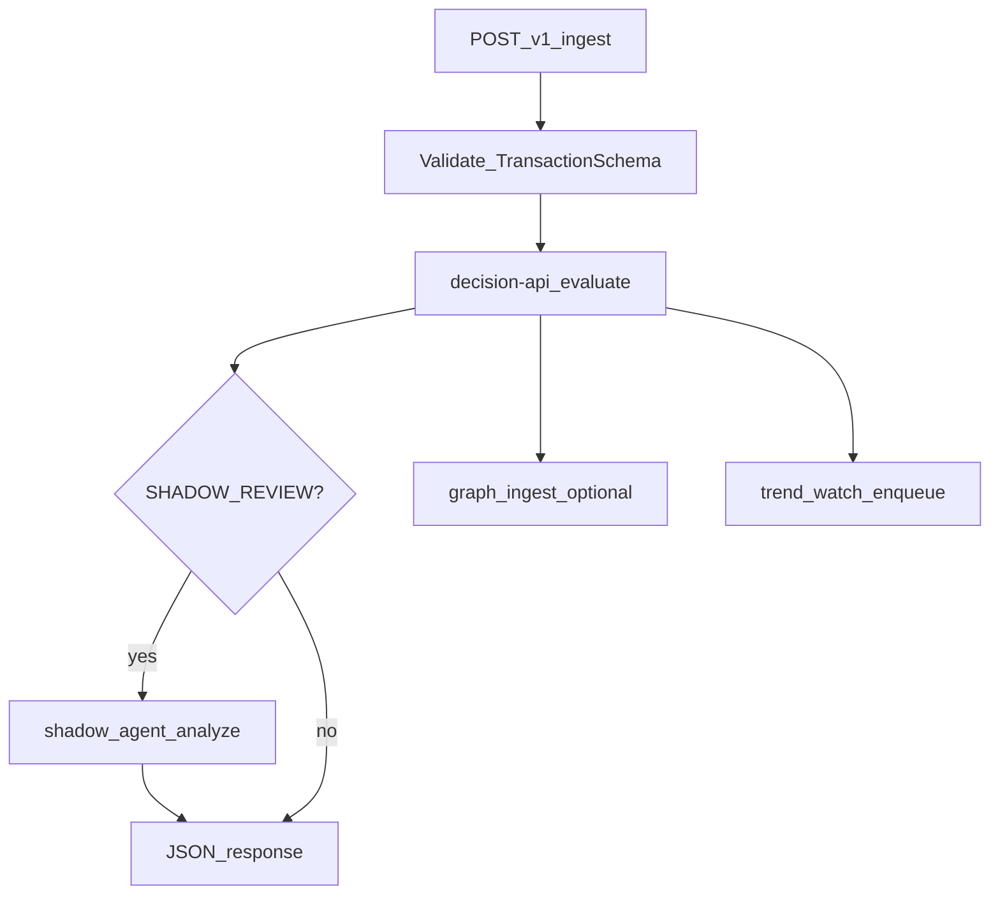
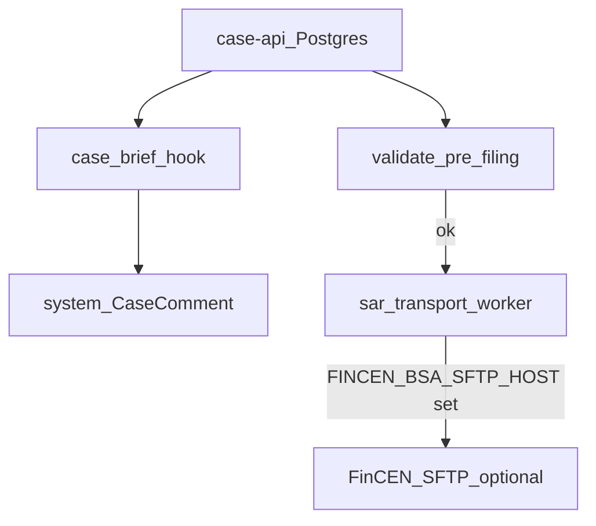
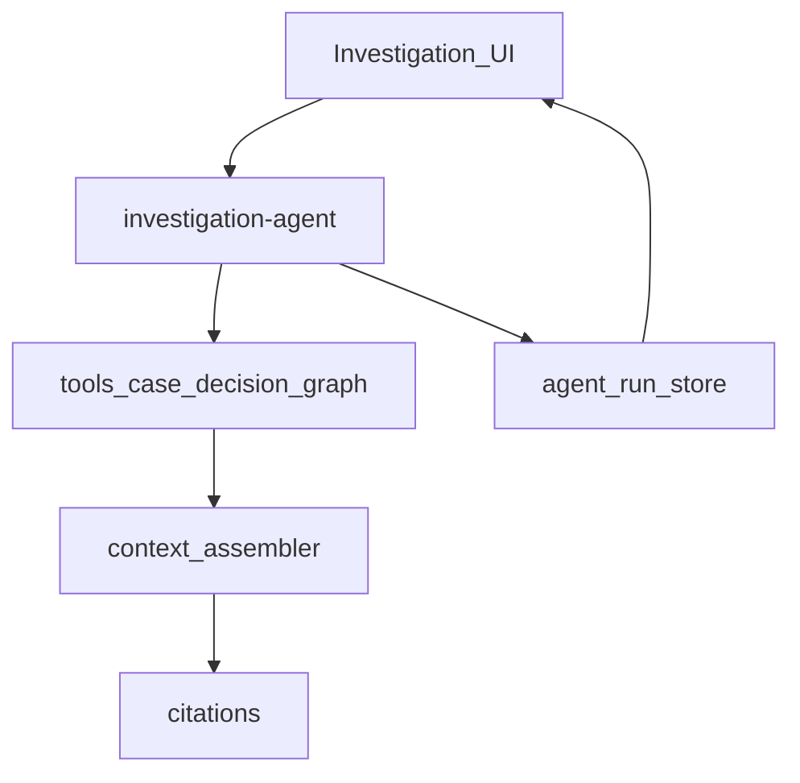
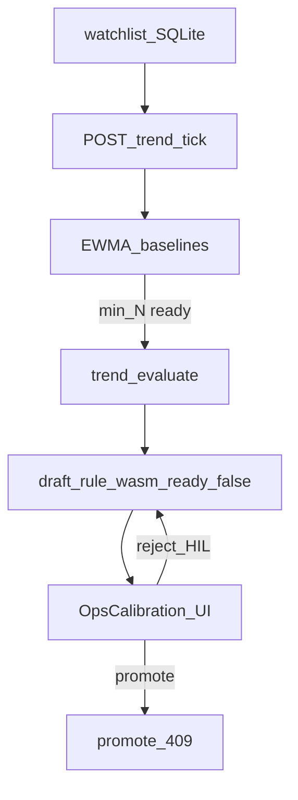
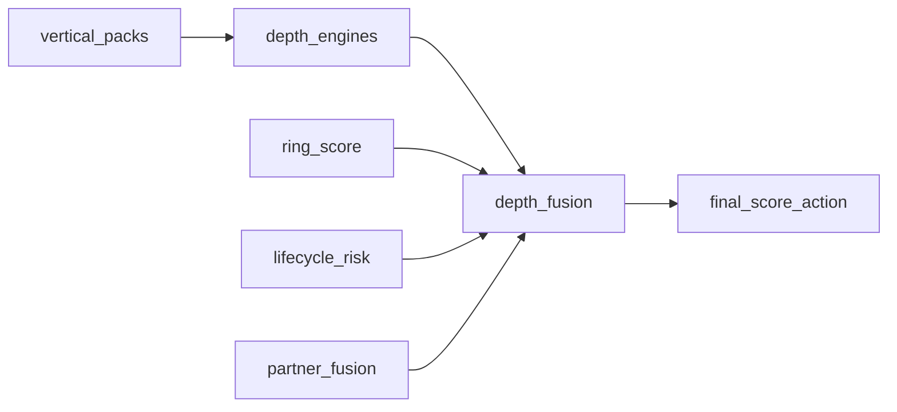

# Feature data flows

How product features move data, who **decides**, and how outcomes affect downstream systems.

**Authority invariant:** `decision-api` (Rust JSON packs via `tarka_rule_engine`) owns allow / deny / flag / review actions. Advise (Shadow agent), investigation, and trend **advise**, escalate, draft, and cite — they never silently clear FLAG→ALLOW or auto-promote WASM.

Related: [repo-productionization-runbook](repo-productionization-runbook.md) · [SYSTEM_DESIGN](../../SYSTEM_DESIGN.md) · [STUB_REGISTER](../../STUB_REGISTER.md) · architecture canvas (IDE).

---

## 1. Synchronous evaluate (authoritative)

Analyst UI / SDK / merchant → nginx → **core-api** `/decisions` → **decision-api** evaluate pipeline.

| Stage | Data in | Data out | Decision effect |
|-------|---------|----------|-----------------|
| Lists / tags | entity, tenant | whitelist/blacklist tags | Hard short-circuit possible |
| Features / ML | entity window | velocity, scores | Inputs to packs + fusion |
| Graph hints | device/IP/user | risk scalars / topology | Feeds relatedness + depth |
| Rules | packs + AST | hit list, base action | Primary policy |
| Depth / ring / lifecycle / partner | vertical evidence | fused deltas | Adjust score / escalate |
| Emit | — | `recommended_action`, audit | Cases / Shadow / webhooks react |

**Downstream of action:**

- `allow` — continue; optional graph writeback  
- `review` / `manual_review` — case creation path  
- `SHADOW_REVIEW` — orchestrator may call Shadow (ingest path)  
- `block` / hold — enforcement adapters + audit  

See also [decide-to-act-enforcement](decide-to-act-enforcement.md).

---

## 2. Orchestrator ingest → decide → Shadow (v2)

| Knob | Effect |
|------|--------|
| `RULE_EVAL_BACKEND=decision_api` | Authoritative evaluate |
| `SHADOW_ACTION_MODULATION=escalate_only` | Shadow cannot clear to ALLOW |
| `TREND_WATCH_ON_INGEST=1` | Fire-and-forget watchlist upsert |
| Graph `signals_usable=false` | Omitted from Shadow context (no fake zeros) |

Compose: `infra/deploy/docker-compose.v2-ingest.yml`.

---

## 3. Cases, brief, SAR

| Feature | Flow | Decision coupling |
|---------|------|-------------------|
| Case open | Evaluate / ops → case-api | Usually follows `review` / high risk |
| Case brief | Hook → markdown comment | Rejects `llm_used=true` |
| SAR | Depth-floor XML parse + TIN/report_id | Filing blocked on validation errors |
| Transport | NATS worker | No host ⇒ no fake SFTP success |

---

## 4. Investigation / AgentRun

| Piece | Role vs decisions |
|-------|-------------------|
| Tools | Read case/decision/graph; never overwrite evaluate action |
| Context assembler | Grounds claims to evidence IDs |
| AgentRun | Persisted run for “View run” in Shadow chat rail |
| Offline LLM | Degraded reply — no invented metrics |

Nginx: `/api/investigation/` → investigation-agent.

---

## 5. Trend ops (advise-only)

| Surface | Effect on production policy |
|---------|----------------------------|
| Draft | Advisory package only |
| Promote | **409** `never_auto_promote` |
| Tick skip LLM | Default `TREND_TICK_SKIP_LLM=1` |
| Desk-strict | Trend ops paths need explicit `VITE_USE_API_MOCKS=true` |

Always-on: `make trend-tick` or compose `--profile trend-tick`.

---

## 6. Depth / vertical fusion → score

Sibling bridges (refund/cancel/dispute) are **advisory / fail-soft**: missing URL ⇒ skip, never forge LIVE.

---

## 7. Ingress / OSINT / graph honesty

| Feature | Data path | If unavailable |
|---------|-----------|----------------|
| Sanctions | FtM cache + Postgres logs | Fail-closed logs; fail-soft JSONL mirror |
| OSINT (demo burst) | ingress HTTP | `mode=unavailable` — no canned risk_score |
| Mule path | demo templates | **501** unless `ALLOW_MULE_PATH_DEMO=1` |
| Janus graph signals | Gremlin | `signals_usable=false` — Shadow omits |
| Neo4j signals | Bolt | `signals_usable=true` — usable topology |

---

## 8. Deploy planes (where flows run)

| Compose | Hosts which flows |
|---------|-------------------|
| `docker-compose.lite.yml` | Evaluate + cases via core-api; trend store volume; desk UI |
| `docker-compose.v2-ingest.yml` | Ingest → decide → Shadow; optional `trend-tick` |
| fraud-desk overlay | Lean nav + desk-strict mocks |

Gateway map: [frontend/nginx.conf](../../../frontend/nginx.conf).

---

## Quick matrix: who can change production decisions?

| Actor | Can set allow/deny? | Can open cases? | Can draft rules? | Can file SAR? |
|-------|---------------------|-----------------|------------------|---------------|
| decision-api evaluate | **Yes** | Indirect | No | No |
| Orchestrator | No (forwards) | Via policy hooks | No | No |
| Shadow | No (escalate only) | Suggest | No | No |
| Trend tick | No | No | Draft only | No |
| Investigation | No | Via tools if permitted | No | No |
| Analyst UI (GitOps) | Via promote/approve | Yes | Yes (human) | Yes (human) |
