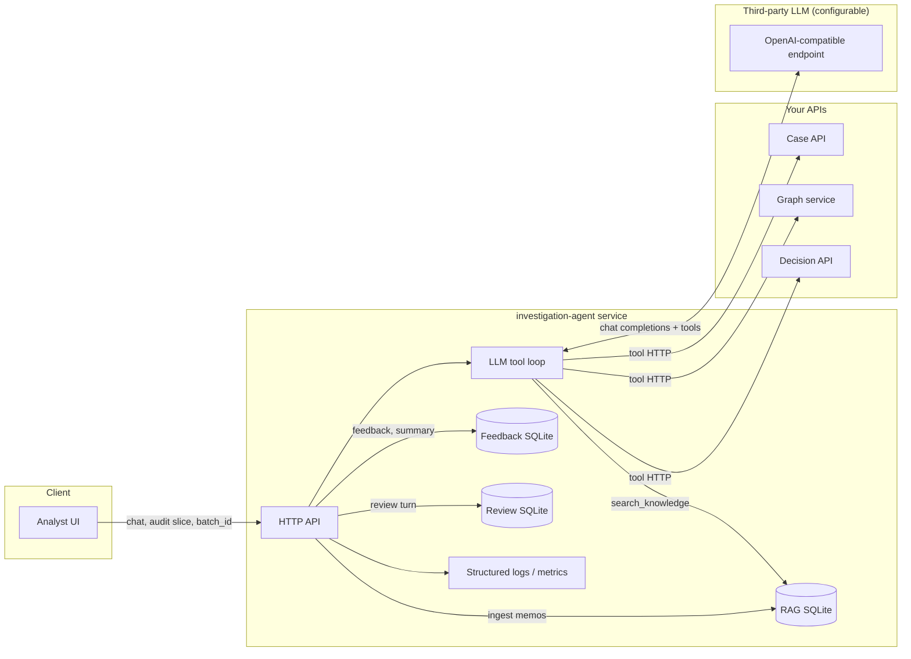

# Investigation Copilot — Intended use, out of scope, and data flows

This page is for **product**, **security**, and **legal** alignment (DPIAs, vendor questionnaires, architecture reviews). It summarizes how the OSS **investigation-agent** (Saarthi) is meant to be used, what it must **not** be relied upon for, and **where data moves**—including prompts, logs, RAG, feedback, optional turn review, and the third-party LLM.

> **Not legal advice.** Intended use and scope must be validated against your **sector**, **jurisdiction**, **contracts**, and **DPA** with qualified counsel and your DPO. Regional builds (`AI_GOVERNANCE_PROFILE`) adjust **prompt wording and deployment defaults**; they do **not** constitute certification or a legal determination of compliance.

## 1. Product intent (executive summary)

The Investigation Copilot is a **human-in-the-loop assistant** that helps analysts work with **existing systems of record** (cases, disputes, graph, decision audits, optional batch uploads, optional investigation memos). It **proposes** narrative summaries and next-step ideas; it **does not** replace case disposition, legal conclusions, or automated decisions in production rule engines unless **your** organization explicitly wires such flows **outside** this service and accepts that risk.

## 2. Intended use (for documentation and procurement)

**In scope — intended use**

- Assist **authorized analysts** (per deployment `tenant_id` / `analyst_id` and `ALLOWED_ANALYSTS` / API key policy) with **fraud and financial-crime-style investigations** using **explicit tools** that read internal APIs.
- Summarize and explain **data returned by those tools** in natural language, with structured add-ons (`claims`, `source_refs`, optional `derived_facts`, optional `evidence_bundle_draft`) to support **transparency and review**.
- Support **analyst-uploaded context**: tabular batches (`POST /v1/batch/ingest`) and text memos (`POST /v1/knowledge/ingest`) **scoped to tenant + analyst**, retrievable via `search_knowledge` (optional embeddings when configured).
- Capture **quality signals** (`POST /v1/feedback`, optional analytics endpoints) and optional **human sign-off records** (`POST /v1/review/turn`) for **workflow and improvement**—not as automatic approval of model correctness.

**Operational assumptions (deployer responsibility)**

- **Identity and access**: who may call the agent API and which tools are exposed (`API_KEYS`, `COPILOT_REQUIRE_INVESTIGATION_API_KEY`, `COPILOT_DISABLED_TOOLS`, maker–checker / `COPILOT_REVIEWER_SECRET` for sensitive tools).
- **Upstream API trust**: case, graph, and decision services enforce **authorization**; the copilot inherits their boundaries.
- **LLM provider choice**: `OPENAI_BASE_URL` + `OPENAI_API_KEY` (or compatible endpoint); **subprocessor** and **data residency** terms are between **customer and provider** unless you offer a managed layer that changes that.

## 3. Out of scope / prohibited reliance

The following are **out of scope** for reliance on the copilot output **without human verification and without your own governance**:

| Topic | Out of scope / limitation |
|-------|---------------------------|
| **Legal or regulatory conclusions** | The service does not provide legal advice, regulatory filings, or guaranteed interpretations of law. |
| **Final case or customer decisions** | Do not treat assistant prose as **dispositive** for approve/deny, SAR filing, litigation positions, or credit decisions unless your process explicitly defines and audits that use. |
| **Truth or completeness of prose** | Prose is **not formally verified**; truncation, tool errors, and model behavior can produce confident wrong narratives. Heuristics (`claims`, grounding, optional strict assurance, optional judge pass) **reduce some risks** but are **not proof**. |
| **Prompt-injection immunity** | Injection handling is **heuristic** (`sanitize` / `reject`). Client-supplied **platform audit** in the prompt is a **supply-chain** risk if enabled; it can be omitted from the model context via `COPILOT_INCLUDE_PLATFORM_AUDIT_IN_PROMPT=false`. |
| **Autonomous action** | The design is **tool-mediated**; the model does not directly mutate production decisions. Tools that persist **draft** labels or run replay are still **high-impact** and should be gated by your RBAC and optional reviewer secret. |
| **Certification** | No profile (`us` / `eu_uk` / `global`) implies ISO, SOC, EU AI Act conformity, or “safe for all regulated data.” |

**“Strict” assurance mode** (`COPILOT_ASSURANCE_MODE=strict`): withholds the model’s investigative summary under **documented machine checks** (e.g. unacknowledged tool errors, unsupported `source=tool` claims). This is a **refusal policy**, not a guarantee that withheld text was wrong or that non-withheld text is right.

## 4. Regional governance builds (US / EU+UK / Global)

Deployments may set **`AI_GOVERNANCE_PROFILE`** to `us`, `eu_uk`, or `global` (see [AI governance regional builds](ai-governance-regional-builds.md)). Effects include:

- **System prompt appendices** (regional expectations for oversight, documentation, minimization themes).
- **Composable defaults** (e.g. batch TTL, optional injection policy) via profile env snippets and Helm values.

**Relationship to this document:** profiles are **governance UX and operator defaults**, aligned with common regional **themes**. They do **not** replace legal analysis, DPIA, or AI Act classification for **your** deployment.

## 5. Data flow map

### 5.1 High-level flow

### 5.2 What crosses each boundary

| Flow | From → To | Typical contents | Operator controls |
|------|-----------|------------------|-------------------|
| **Chat → LLM** | investigation-agent → LLM provider | System prompt (incl. optional regional block + playbook), **sanitized** user/assistant messages, **optional** sanitized platform audit text, tool definitions, tool result JSON (truncated) | `OPENAI_*`, `COPILOT_MAX_*`, `COPILOT_INCLUDE_PLATFORM_AUDIT_IN_PROMPT`, `COPILOT_INJECTION_POLICY`, `AI_GOVERNANCE_PROFILE` |
| **Tools → upstream** | investigation-agent → Case/Graph/Decision APIs | Tenant/analyst **server-scoped**; tool args validated; PII per **your** case/graph/decision policies | Upstream auth, network policy |
| **Memo ingest → RAG** | Client → agent → disk | `tenant_id`, `analyst_id`, title, body; optional embedding vectors | `INVESTIGATION_DATA_DIR`, `COPILOT_RAG_DB_NAME`, `COPILOT_KNOWLEDGE_EMBEDDINGS`, `OPENAI_API_KEY` (if embedding) |
| **RAG → LLM** | SQLite → agent → LLM | Chunks retrieved by `search_knowledge` enter **tool results**, then may appear in LLM context | Same as tool truncation + tool allowlist |
| **Feedback** | Client → agent → disk | `turn_id`, rating, note, optional tags; tenant/analyst resolved or supplied | `INVESTIGATION_DATA_DIR`, `COPILOT_FEEDBACK_DB_NAME` |
| **Turn review** | Client → agent → disk | `turn_id`, tenant, analyst, approved/rejected, note | `COPILOT_REVIEW_DB_NAME` |
| **Logs / metrics** | investigation-agent → your observability | e.g. tool counts, tenant/analyst ids, model id—**no** full prompt dump by default in doc’d design; verify your log config | Log redaction, retention, SIEM policy |

### 5.3 On-disk persistence (same host as agent by default)

| Store | Env | Purpose |
|-------|-----|---------|
| RAG / knowledge chunks | `INVESTIGATION_DATA_DIR` + `COPILOT_RAG_DB_NAME` | Memo text; optional `embedding_json` |
| Feedback + turn metadata | `INVESTIGATION_DATA_DIR` + `COPILOT_FEEDBACK_DB_NAME` | Ratings, `record_turn` row |
| Human sign-off | `INVESTIGATION_DATA_DIR` + `COPILOT_REVIEW_DB_NAME` | Approved/rejected records |

**Encryption at rest** for these files is **environment-dependent** (disk encryption, volume policies)—not enforced by the application layer in the OSS reference.

## 6. Third-party LLM (subprocessor)

Any content sent in **§5.2 Chat → LLM** may be processed by the configured provider under **their** terms. For procurement:

- List the LLM endpoint as a **subprocessor** (or customer-hosted inference as **non-subprocessor**, depending on architecture).
- Align **retention**, **training opt-out**, and **region** with your DPA.
- **BYOK / VPC / self-hosted** models change the diagram but not the obligation to map **what** is sent (still includes prompts + tool payloads).

Detail: [Investigation Copilot — LLM data flow](investigation-agent-llm-data-flow.md).

## 7. Logging and observability

Structured logs may include **operational identifiers** (tenant, analyst, case id, tool names, error counts). Treat log streams as **sensitive**; apply retention and access controls consistent with GDPR, sector rules, or internal policy. **Do not** enable verbose logging of full prompts or raw PII in production without explicit review.

## 8. Related documents

- [Investigation Copilot — integration contract](investigation-agent-integration-contract.md) — `GET /v1/integration`, tool families, `profile_id`
- [Investigation Agent Project](../projects/investigation-agent-project.md) — capabilities and OSS limitations
- [Investigation Copilot — LLM data flow](investigation-agent-llm-data-flow.md) — subprocessor-oriented detail
- [AI governance regional builds](ai-governance-regional-builds.md) — US / EU+UK / Global profiles
- [Investigation Copilot — assurance modes](investigation-agent-assurance-modes.md) — strict refusal, derived facts, review API
- [Security scanning](security-scanning.md) · [SECURITY.md](../../../SECURITY.md)
