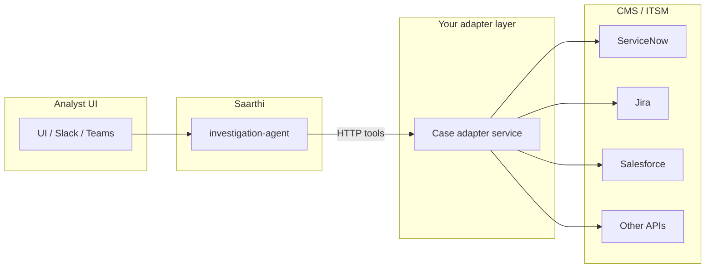

# Investigation queues, CMS / ITSM, and Saarthi integration

This guide lists **common systems teams use for investigations, cases, and work queues**, and describes **how to integrate them with the investigation copilot** (Saarthi / `services/investigation-agent`) without coupling the core agent to every vendor API.

> **Scope:** There is no single exhaustive “all CMS tools” list—enterprises mix vendors by region and line of business. Below is a **practical catalog** by category, plus **integration patterns** that scale.

## How Saarthi expects case data today

The OSS agent talks to a **Case API** abstraction (`CASE_API_URL`): tools like `get_case` and `list_cases` assume **your** service returns case-shaped JSON. Graph and Decision APIs are separate.

So **ServiceNow, Jira, Salesforce, etc. are not called directly by the core agent** unless you add vendor-specific code. The maintainable approach is an **adapter** (thin service or sidecar) that implements **your** case contract and translates to each CMS.

---

## 1. ITSM / enterprise service management

| Platform | Typical use | API surface (indicative) | Notes |
|----------|-------------|----------------------------|--------|
| **ServiceNow** | Incidents, problems, change, GRC, SecOps modules | [Table API](https://www.servicenow.com/docs/csh?topicname=c_TableAPI.html&version=latest) `GET/POST/PATCH /api/now/table/{table}` (e.g. `incident`, `sn_si_incident`, custom tables) | Highly customizable tables; use **scoped app** + **IntegrationHub** or Scripted REST for stable contracts. |
| **Jira Service Management** | Queues, SLAs, service requests | [Jira Cloud REST](https://developer.atlassian.com/cloud/jira/platform/rest/v3/) — issue search via JQL (`/rest/api/3/search/jql` pattern per current Atlassian docs) | Good fit for “queue = JQL filter”; map **issue key** ↔ internal `case_id`. |
| **BMC Helix / Remedy** | ITSM, digital workplace | REST APIs (versioned per product) | Often on-prem; plan **network + auth** (OAuth, certificates). |
| **Cherwell** | Service desk | REST / mAPI (product-specific) | Check version; many deployments are customized. |
| **Ivanti / Heat / Neurons** | ITSM | Vendor REST | Same adapter idea. |
| **ManageEngine ServiceDesk Plus** | IT helpdesk | REST API | Common in mid-market. |

---

## 2. Work management / “case as issue”

| Platform | Typical use | API surface | Notes |
|----------|-------------|-------------|--------|
| **Jira Software / Work Management** | Dev + ops work, fraud triage projects | Jira REST + JQL | Same Jira stack as JSM; **project + issue type** defines the “case.” |
| **Azure DevOps** | Work items | [REST APIs](https://learn.microsoft.com/en-us/rest/api/azure/devops/) | WIQL queries for queues. |
| **GitHub / GitLab** | Issues as lightweight cases | Issues API | For dev-centric fraud/abuse queues. |
| **Linear** | Issue tracking | GraphQL / REST | Smaller teams. |
| **Asana / Monday.com** | Work management | Vendor REST | Less common for regulated investigations; possible for lightweight workflows. |

---

## 3. CRM and industry case systems

| Platform | Typical use | API surface | Notes |
|----------|-------------|-------------|--------|
| **Salesforce** | Cases, Financial Services Cloud, alerts | [REST / Composite / Bulk](https://developer.salesforce.com/docs/atlas.en-us.api_rest.meta/api_rest/) | Strong for **KYC / alerts**; map **Case Id** + custom objects. |
| **Microsoft Dynamics 365** | Case management | [Web API](https://learn.microsoft.com/en-us/power-apps/developer/data-platform/webapi/overview) | OData; common in Microsoft-centric orgs. |
| **Pega Platform** | Case lifecycle | REST services from case types | Heavy customization—adapter usually **per implementation**. |
| **Appian** | Low-code cases | Web APIs | Export stable endpoints from process models. |

---

## 4. Security operations & SOC tooling (incident / case-like)

| Platform | Typical use | Integration angle |
|----------|-------------|-------------------|
| **Microsoft Sentinel / Defender** | Incidents, alerts | Microsoft Graph / Sentinel APIs; often already integrated with **Microsoft 365** identity. |
| **Splunk SOAR (Phantom)** | Playbooks, cases | REST; often drives **orchestration** rather than narrative copilot—still can feed **context** to Saarthi. |
| **Google Chronicle / SecOps** | Cases, entities | APIs (Google Cloud); entity-centric. |
| **IBM QRadar** | Offenses, events | REST; offense IDs as case keys. |
| **TheHive / Cortex** | Open-case management for DFIR | REST; popular in OSS-heavy teams. |
| **Elastic / Kibana Cases** | Cases in Elastic Stack | APIs tied to stack version. |

These often complement—not replace—ITSM; many teams use **ServiceNow or Jira** for human workflow and a **SIEM/SOAR** for alerts.

---

## 5. Fraud / AML vendor ecosystems (representative)

| Category | Examples | Integration |
|----------|----------|---------------|
| **Enterprise fraud hubs** | Actimize, SAS Fraud, FICO, BAE / NetReveal | Vendor-specific APIs or file-based; usually **strict contracts** with the vendor. |
| **Case hubs in banking cores** | Often custom DB + UI | JDBC/ETL to adapter, or REST facade written by the bank. |

Treat these like **Salesforce/Dynamics**: one **adapter per vendor contract**, not logic inside the LLM.

---

## 6. Recommended integration patterns

### A. **Case adapter service** (recommended)

1. Implement a small service that exposes **the same shapes your Case API already uses** (or a documented minimal contract: `GET /cases/{id}`, `GET /cases?queue=…&limit=…`).
2. Translate **ServiceNow sysparm_query**, **Jira JQL**, **Salesforce SOQL**, etc., inside the adapter.
3. Point `CASE_API_URL` at the adapter (or run multi-tenant routes: `tenant_id` → backend CMS).
4. Saarthi tools (`get_case`, `list_cases`, `compare_entity_queue_snapshot` where applicable) work **unchanged**.

**Pros:** Clear security boundary, versioning, tests without LLM. **Cons:** You maintain the adapter.

### B. **Sync queue → batch / knowledge**

1. Scheduled job: export CMS queue (CSV/JSON) → `POST /v1/batch/ingest`.
2. Long-form policies / runbooks → `POST /v1/knowledge/ingest`.
3. Copilot uses **tabular tools** + **search_knowledge** for analysis when live Case API is optional.

**Pros:** Fast for pilots. **Cons:** Not real-time; define refresh SLA.

### C. **Webhooks → collaboration bridge**

CMS posts updates to your **collaboration-chat-bridge** or a small ingress service that translates events into `messages[]` / `platform_audit` for `POST /v1/chat` (see [investigation-agent-project.md](../projects/investigation-agent-project.md)).

**Pros:** Thread-aligned copilot in Slack/Teams. **Cons:** Needs careful **PII redaction** and idempotency.

### D. **Native vendor tools** (ServiceNow / Jira “AI”)

Vendors offer their own AI; **Saarthi** differentiates when you need **your** fraud/decision/graph stack + **evidence_bundle** + **BYOK**. Integration is still valuable for **queue and record sync**.

---

## 7. ServiceNow — concrete starting points

- **Table API:** `GET https://{instance}.service-now.com/api/now/table/{table}?sysparm_query=...`
- Common tables: `incident`, `sn_si_incident` (SecOps — name may vary by module), **custom** tables for fraud cases.
- **Auth:** Basic (user/password) or OAuth; use **integration user** with least privilege.
- **Queue definition:** Encode as **saved filter** or **sysparm_query** in the adapter (e.g. state, assignment group, category).

Map: `sys_id` or `number` → canonical `case_id` in your adapter responses.

---

## 8. Jira — concrete starting points

- **JQL** defines the queue, e.g. `project = FRAUD AND status = Open AND assignee = empty`.
- **Cloud:** Use current [Jira Cloud search/JQL APIs](https://developer.atlassian.com/cloud/jira/platform/rest/v3/) per Atlassian’s documentation (pagination via `nextPageToken` where applicable).
- **Auth:** API token + email, or OAuth for apps.
- Map: **issue key** (e.g. `FRAUD-123`) → `case_id`.

---

## 9. Security, compliance, and ops checklist

| Topic | Action |
|-------|--------|
| **Secrets** | CMS credentials in vault/K8s secrets; never in prompts or logs. |
| **Scope** | Integration user: read queue + read case; writes only if workflow requires it. |
| **PII** | Redact before RAG; align with DPA for each CMS. |
| **Audit** | Log adapter requests with correlation id; Saarthi already emits tool traces. |
| **Rate limits** | Respect vendor throttles; backoff in adapter. |

---

## 10. OSS repo next steps (when you build it)

1. **Document** your canonical Case JSON schema (OpenAPI alongside `contracts/openapi/investigation-agent.yaml`).
2. **Add** `integration_profile_id` values per adapter (already supported for parity checks).
3. **Optional:** Reference **adapter** repo or Helm chart per CMS (ServiceNow, Jira first—highest demand).

This file is the **product/architecture** anchor; implementation tickets should reference **one CMS per adapter** to keep supportability manageable.
