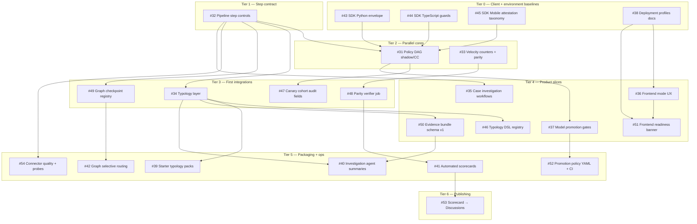

# OSS adoption backlog: dependency-aware ship order

This guide defines **must-do-before** relationships for GitHub issues **`#31`–`#54`** (label `borrowed-from-OSS`). It is independent of milestone dates: use it to **reorder work** when dates slip, or to **parallelize** within a tier.

## Prerequisites (outside this backlog)

Epics **`#1`–`#12`** (inference contract, replay, counters, challenge/location, analyst flows) are assumed in progress or complete. The OSS wave builds on stable **decision paths**, **audit payloads**, and **counter primitives**.

## Dependency graph (must-do-before)

Edges read as **A → B** meaning **finish A before B** (or land A’s contract before B integrates).

### Edge rationale (short)

| From | To | Why |
|------|----|-----|
| #43–#45 | #31 | Client traffic must send **envelope / integrity / attestation** fields before canary/shadow/CC paths are meaningful in production-like tests. |
| #38 | #36 | **Detection vs compliance** UI needs documented **backend profile** and env semantics to avoid lying to analysts. |
| #38 | #51 | **Readiness/degraded** panel needs the same **profile** semantics as mode UX. |
| #36 | #51 | **Banner/panel** UX should align with **mode** surfaces (shared patterns, copy, and API contracts). |
| #32 | #31 | **DAG** should orchestrate **typed steps** with timeouts, retries, and `onFailure` — not ad-hoc calls. |
| #31 | #47 | **Canary cohort** metadata in audit assumes **routing** exists. |
| #31 | #37 | **Promotion gates** assume **champion/challenger** (or shadow) signals exist. |
| #32 | #34 | **Typology** input should be **normalized step outputs**, not raw spaghetti. |
| #32 | #49 | **Checkpoint profiles** are a form of **orchestration config**; align with step failure semantics. |
| #32 | #54 | **Connector probes** behave like **steps** with health and timeouts. |
| #34 | #46 | **DSL/registry** is an implementation slice **on top of** the typology layer. |
| #34 | #39 | **Starter packs** need stable **typology IDs** and scoring contract. |
| #34 | #50 | **Evidence bundles** need **typology** (and rule) references. |
| #33 | #48 | **Parity verifier** validates **counter** implementations. |
| #49 | #42 | **Selective graph evaluation** consumes **checkpoint registry**. |
| #32 | #35 | **Case workflows** benefit from **structured step failure** and audit consistency. |
| #37 | #52 | **CI enforcement** should implement the **promotion policy** defined by gates. |
| #50 | #40 | **Agent summaries** should emit **bundle-shaped** evidence. |
| #34 | #40 | Summaries need **typology-keyed** drivers. |
| #48 | #41 | **Scorecards** are trustworthy only if **parity** holds on golden fixtures. |
| #41 | #53 | **Weekly publisher** consumes **scorecard** output. |

## Topological ship order (recommended merge sequence)

Within a tier, issues can ship in **any order** unless an edge crosses tiers.

1. **Tier 0:** #43, #44, #45, #38  
2. **Tier 1:** #32  
3. **Tier 2:** #31 and #33 (parallel)  
4. **Tier 3:** #47, #34, #48, #49 (parallel after their parents)  
5. **Tier 4:** #46, #35, #36, #51, #37, #50 (parallel where parents done; **#51** after **#36** if you want one mode UX pass first)  
6. **Tier 5:** #39, #40, #41, #42, #52, #54  
7. **Tier 6:** #53  

## Minimal critical path (if you must cut scope)

If you can only ship a thin spine:

`#32 → #31 → #34 → #50 → #40`  
and in parallel when possible: `#33 → #48 → #41`.

## How to use with GitHub milestones

Milestone dates are a **calendar**. This doc is the **DAG**. When a week slips:

- Move the milestone on issues, but **keep parent issues** merged first.
- Use **Project swimlanes** for ownership; use this page for **ordering**.

## Related

- [Evaluation step controls](./evaluation-step-controls.md) — **#32** implementation in Decision API (timeouts, retries, metrics, audit `step_trace`).
- [OSS track issue closure evidence (checklist)](./oss-track-issue-closure-evidence-2026-04.md) — merge SHAs and what to close to reduce sprawl.
- [Pending ships rebundled by user journey](./journey-ship-bundles.md) — **J1–J5** journeys (integrate, decide, investigate, govern, operate) mapped to the same issues and releases; use with this DAG for cohesive trains.
- Issues: [label `borrowed-from-OSS`](https://github.com/pamu512/tarka/issues?q=is%3Aissue+label%3Aborrowed-from-OSS)
- Project: [Tarka Module Swimlanes](https://github.com/users/pamu512/projects/3)
